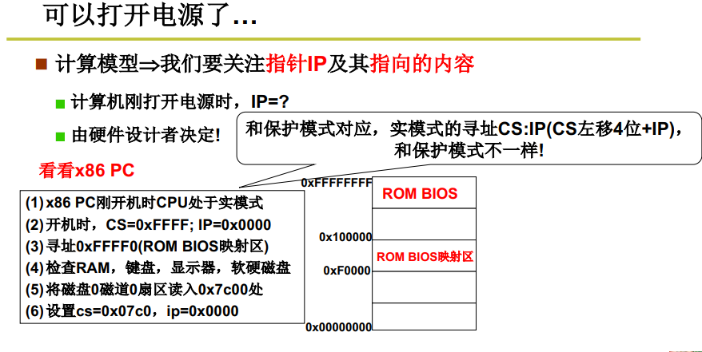

## 1. 揭开操作系统的盖子

### 1.1 计算机三级结构

|   APP    |
| :------: |
|    OS    |
| hardware |

### 1.2 保护模式

> 保护模式，是一种80286系列和之后的x86兼容[CPU](https://baike.baidu.com/item/CPU)操作模式。保护模式有一些新的特色，设计用来增强[多工](https://baike.baidu.com/item/多工/9957464)和系统稳定度，像是 内存保护，[分页](https://baike.baidu.com/item/分页/2888444) 系统，以及硬件支援的 虚拟内存。大部分的现今 x86 [操作系统](https://baike.baidu.com/item/操作系统/192) 都在保护模式下运行，包含 Linux、FreeBSD、以及 [微软](https://baike.baidu.com/item/微软/124767) Windows 2.0 和之后版本。
>
> [保护模式-百度百科]([https://baike.baidu.com/item/%E4%BF%9D%E6%8A%A4%E6%A8%A1%E5%BC%8F/3209404](https://baike.baidu.com/item/保护模式/3209404))

### 1.3 引导扇区

> 磁盘0磁道0扇区

引导扇区代码：==bootsect.s==

### 1.4 主引导记录的内存地址为0x7c00

> 0x7C00这个地址来自Intel的第一代个人电脑芯片[8088](https://en.wikipedia.org/wiki/Intel_8088)，以后的CPU为了保持兼容，一直使用这个地址。
>
> 当时，搭配的操作系统是[86-DOS](https://en.wikipedia.org/wiki/86-DOS)。这个操作系统需要的内存最少是32KB。我们知道，内存地址从0x0000开始编号，32KB的内存就是`0x0000～0x7FFF`。
>
> 8088芯片本身需要占用`0x0000～0x03FF`，用来保存[各种中断处理程序](https://en.wikipedia.org/wiki/BIOS_interrupt_call)的储存位置。（主引导记录本身就是中断信号INT 19h的处理程序。）所以，内存只剩下`0x0400～0x7FFF`可以使用。
>
> **为了把尽量多的连续内存留给操作系统，主引导记录就被放到了内存地址的尾部。**由于一个扇区是512字节，主引导记录本身也会产生数据，需要另外留出512字节保存。所以，它的预留位置就变成了：
> $$
> 0x7FFF - 512 - 512 + 1 = 0x7C00
> $$

计算机启动后，32KB内存的使用情况如下:

> +--------------------- 0x0
> | Interrupts vectors
> +--------------------- 0x400
> | BIOS data area
> +--------------------- 0x5??
> | OS load area
> +--------------------- 0x7C00
> | Boot sector
> +--------------------- 0x7E00
> | Boot data/stack
> +--------------------- 0x7FFF
> | (not used)
> +--------------------- (...)

