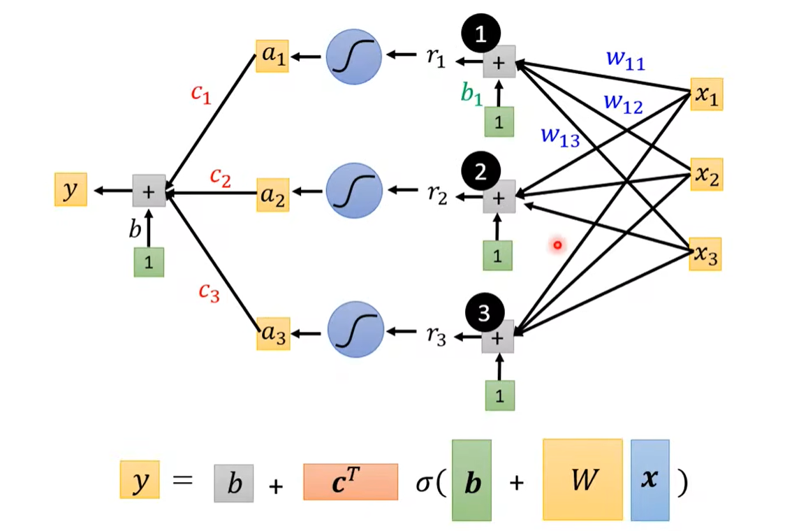
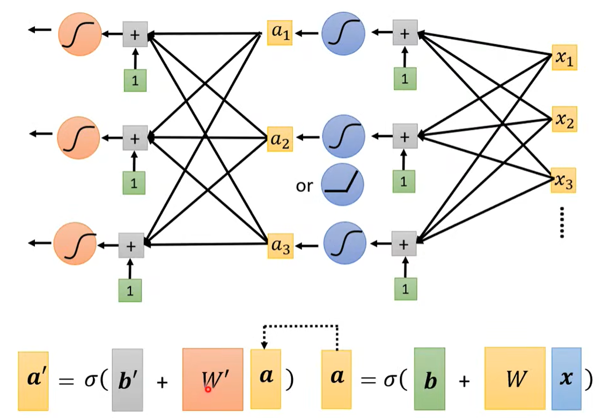

### 机器学习/深度学习简介

> 1、机器学习就是寻找一个目标函数
>
> 2、回归、分类、结构化学习
>
> 3、==*model*==：带有未知参数的函数 function
>
> 4、==*bias*== 偏移量, ==*weight*== 权重, ==*feature*== 特征
>
> 5、==*Loss*==：损失函数
>
> 6、==*model bias*==：模型偏差，模型设计的过于简单
>
> 7、==*more features*==：用多段sigmoid函数近似多段线性曲线近似各种曲线。
> $$
> y = b + \sum_i(c_i*sigmoid(b_i+\sum_jw_{ij}*x_j))
> $$
> 
>
> 8、激活函数：==sigmoid==、==ReLU==
> $$
> sigmoid(b_i+\sum_jw_{ij}*x_j)、max(0, b_i+\sum_jw_{ij}*x_j)
> $$
> 9、增加层数：
>
> 
>
> 10、深度学习：深度 = 多隐藏层

