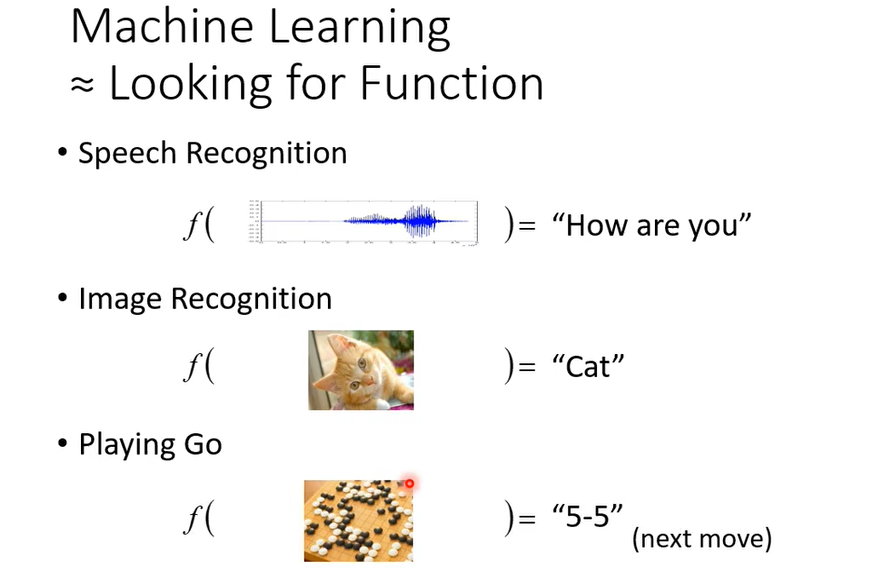
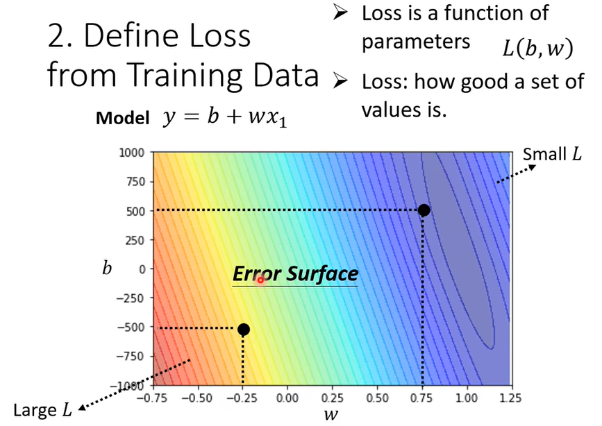
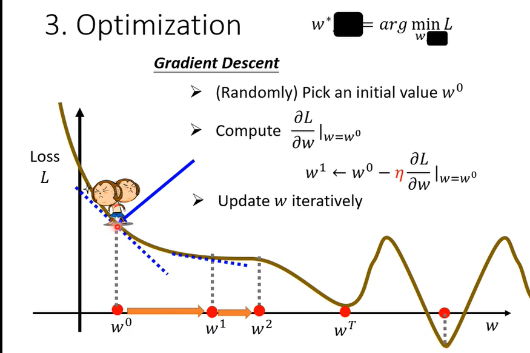
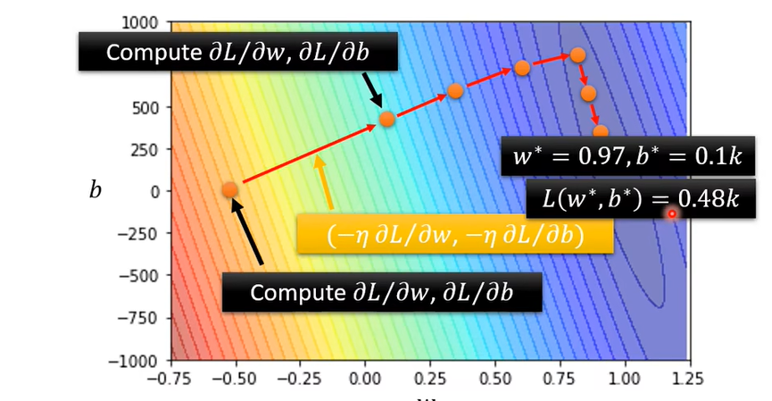
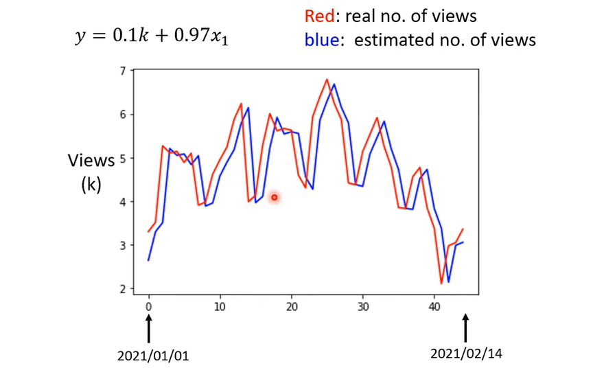
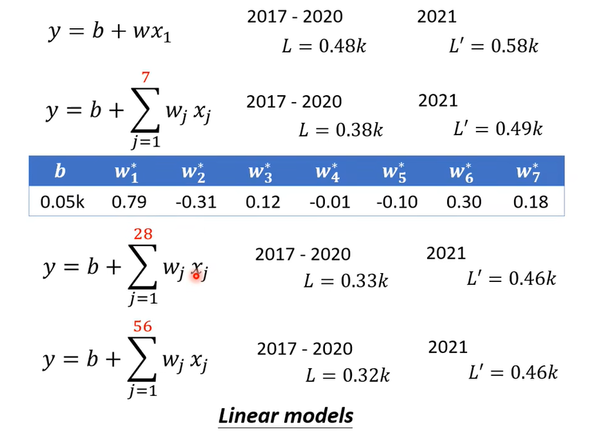

### 机器学习概述

1、什么是机器学习呢？

机器学习就是寻找一个目标函数。例如：

- 语音识别：寻找一个**输入是语音，输出是识别出的文字**的目标函数。
- 图像识别：寻找一个**输入是图像，输出是类别**的目标函数。
- 围棋：寻找一个**输入是棋局，输出是下一步棋子位置**的目标函数。

2、机器学习的类别：

- **回归（Regression）**：函数的输出是物体的==值==
- **分类（Classification）**：函数的输出是物体的==所属类别==
- **结构化学习（Structured Learning）**：输入输出都是一种==带有结构的对象==（Sequence 序列，list，tree，bounding box 边界框），例如：
  - Speech recognitian(语音辨识)：
    - $X:Speech \space signal(Sequence) \rightarrow Y:text(Sequence)$
  - Translation(翻译)：
    - $X:Mandarin \space sentence(Sequence) \rightarrow Y:English \space sentence(Sequence)$
  - Syntatic Paring(文法解析)：
    - $X:sentence \rightarrow Y:文法解析树(tree \space structure)$
  - Object Detection(目标检测)：
    - $X:image \rightarrow Y:bounding \space box$ ，将目标框出来。
  - Summarization(摘要提取)：
    - $X:long \space document \rightarrow Y:summary(short \space paragraph)$
  - Retrieval(检索)：
    - $X:keyword \rightarrow Y:search \space result (a \space list \space of \space webpage)$，返回网页集合。

3、上面提到，机器学习就是寻找一个目标函数，那么如何寻找这个目标函数？以“预测视频下一天的播放量”问题为例：

- **步骤一：**猜测一个带有**未知参数**的函数形式（基于 ==domain knowledge== **领域知识** 去猜测，也就是对这个问题有一定正确的知识基础去猜测），这里我们首先简单的用**基于当天播放量的线性函数**作为猜测函数，我们把这个函数叫做==*model*== **模型**。图示中：
  - $y$ 为下一天的预测播放量
  - $x$ 为当天播放量，我们将其称之为 ==feature== **特征**
  - 与 $x$ 相乘的参数 $w$ 称之为 ==*weight*== **权重**，相加的参数 $b$ 称之为 ==*bias*== **偏移量**

- **步骤二：**定义==*Loss*==：**损失函数**，输入为未知参数 $(b,w)$ 。损失函数的输出代表了参数值 $(b,w)$ 下模型的好坏。
  - Loss 形式：$Loss=L(b,w)=\frac{1}{N}\sum_j e_n$
  - ==MAE==平均绝对误差$e_n=|y_n-\widehat{y_n}|$、==MSE==均方差$e_n=|y_n-\widehat{y_n}|^2$，这里我们采用MAE 
  - 另外，若 $y$ 和 $\widehat{y}$ 都是统计概率分布，那么还可以用==cross-entropy==交叉熵（后续涉及）
  
  - ==error surface==：**误差面**，Loss 等高线图。依据上一步定义的损失函数，计算不同 $(b,w)$ 下的 Loss 值并画出等高图。如下图，颜色越深代表 Loss 值越大。
  

- **步骤三：**==Optimization== **优化**：寻找一个未知参数值 $(b^*,w^*)$ ，使得损失函数输出值最小，也即使得模型最优。（也即 Loss 等高线图中颜色最浅的位置）

  - **梯度下降法**：只以权重参数 $w$ 为例
    - 随机取一个点 $w^0$
    - 计算该点的梯度 $\frac{\partial{L}}{\partial{w}}|_{w=w^0}$
    - 沿梯度下降的方向更新参数 $w^1 \leftarrow w^0-\eta\frac{\partial{L}}{\partial{w}}|_{w=w^0}$
    - 循环更新。直到梯度为0，或达到**更新次数**上限。
    - ==hyperparameters== **超参数**：需要自己设定的参数，如： ==learning rate== **学习率**$\eta$、更新参数的次数
  - 我们的目标是找到全局最小值，但梯度下降似乎容易陷入局部最小值？
    - *其实梯度下降法的问题不在局部最小值，后续会讲解。*

  - 两个参数 $(b,w)$ 时的梯度下降法，同一个参数类似。
  - 图示如下，随机取一个点 $(b^0,w^0)$ ，计算梯度，并沿梯度方向更新参数，循环往复，最终期待到达一个 Loss 值最小的位置。

4、上述学习步骤可以概括为：1.定义带未知参数的函数；2.定义损失函数；3.进行优化。

- 我们把这些步骤称为 ==Training== **训练**，我们用于训练的数据称为**训练数据**，那么我们基于训练数据训练的模型，仅是在训练数据上达到的所谓最优，在其他数据上，这里称为**测试数据**，是否也能取得较好的结果呢？

- 下图是“预测视频下一天的播放量”问题的预测结果同实际值的对比图，可以看到，基于当天播放量定义的**线性函数模型**的预测曲线，几乎就相当于滞后了实际值一天而已。

- 显然，这是不太合理的，实际上当天播放量和下一天播放量的关系似乎并没有那么紧密。观察曲线，似乎每过一段时间就有一个波峰和波谷，这一段时间恰好是一周，我们可以猜测可能是一周中有工作日与休息日的原因，那么类似这种知识呢我们就把它称为**领域知识**（==domain knowledge==）。调整**特征变量**为前 7 天每天的播放量，可以定义新的 ==model== **模型**。
- 把新的模型训练至最优，可以发现效果确实好一些；同样，我们可以猜测是否是以月作为一个循环呢，增加**特征变量**为前 28 天的播放量，发现效果又更好一些；那么在此基础上再多增加**特征变量**会不会更好呢，增加**特征变量**为前 56 天的播放量，可以发现尽管在训练集上似乎有一些优化，但在预测方面的 Loss 值并没有变小，说明前两个月相较于前一个月的关系并没有更有效。（猜测以一年作为循环是否会更有效呢？待验证）

- ==Linear models== **线性模型**：把这种线性函数模型成为线性模型。

