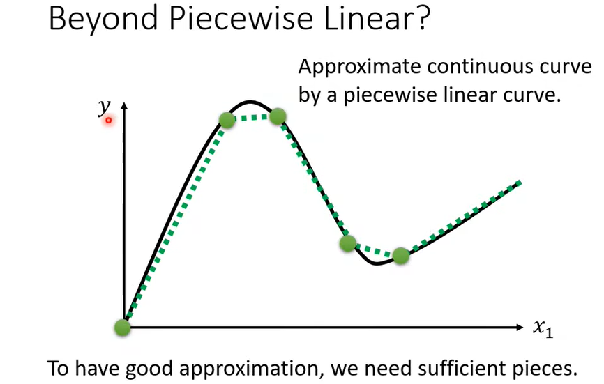

### 深度学习概述

1、之前我们所提及的线性模型显然太过简单了，大多数问题的模型显然复杂到人类难以找到，而非是一个简单的线性函数。例如：图像识别，下围棋等等。我们把这种设计的过于简单的模型所引起的问题称为：

- ==*model bias*==：**模型偏差**，即模型设计的过于简单

2、如何设计更加复杂的模型呢？

- 首先以图中的红色曲线为例，如何设计模型来表示这条曲线呢？

  - 我们可以把这红色曲线的函数拆分成 $常数 + 多段蓝色形式的曲线之和$ 。(常数=曲线与 $y$ 轴交点)

  - 那么比较明显，对于每一段转折的曲线，用蓝色曲线倾斜的部分去替代，由于蓝色曲线前后两端都是平稳的，那么把所有蓝色曲线相加，就能够得到红色曲线。

  - 显然所有分段线性曲线都可用这种形式替代。
  - 那么对于**非线性曲线**呢？其实只要我们在曲线上取足够多的点，并用线段将这些点连接起来构成分段线性曲线，那么我们可以用**这个分段线性曲线去近似这个非线性曲线**，也即可以用上述多段蓝色曲线之和的形式去**近似所有的曲线**，包括线性与非线性。                                   

3、现在我们的问题是如何去写出蓝色曲线的函数形式。

- 这里我们用经典的 ==sigmoid== 函数来近似这种蓝色曲线，$sigmoid(x)=\frac{1}{1+e^{-x}}$。
- 实际上上述蓝色曲线形式也被称为 ==hard sigmoid== 函数，$\sigma(x)=clip(\frac{x+1}{2},0,1)=max(0,min(1,\frac{x+1}{2}))$。（相对的 sigmoid 也叫 soft sigmoid）
- hard sigmoid也有其优点，但是 sigmoid 优点：**连续，且平滑便于求导**。
- 这里稍微调整 sigmoid 形式，就可以近似蓝色曲线。

- 然后我们通过调整参数，来改变曲线的各种形式，以此来逼近任何曲线。
  - 改变 $w$，改变曲线的斜率。
  - 改变 $b$，左右平移曲线。
  - 改变 $c$，改变曲线的上界。

4、接下来就是考虑如何用多段 sigmoid 函数近似多段线性曲线，进而近似各种曲线。

- 对于一个**特征变量** $x_1$ 的模型：

$$
y = b + \sum_i(c_i*sigmoid(b_i+w_i*x_1))
$$

- 之前我们提到过，==*more features*== 多特征变量的模型往往效果更好，所以函数形式又可以变为：

$$
y = b + \sum_i(c_i*sigmoid(b_i+\sum_j w_{ij}*x_j))
$$

- 以只有 3 个特征变量为例，我们尝试用 3 个 sigmoid 函数去逼近。

  - 那么对于 $(b_i+\sum_j w_{ij}*x_j))$ ，可以用图示表示为：

  - 用 $r_i$ 来表示 $(b_i+\sum_j w_{ij}*x_j))$ 后，对于上述 3 个式子，可以用矩阵运算来简化其形式，分别用向量和矩阵来表示 $r_i、b_i、w_{ij}、x_j$。                                        
  - 同理，对于 $y = b + \sum_i(c_i*sigmoid(b_i+\sum_j w_{ij}*x_j))$ ，可以用图示表示为：
- 对于目前得到的携带未知参数的函数形式，我们再定义一下其中的各类变量：
  - 向量 $\boldsymbol{x}$ 称为 ==feature vector== **特征向量**
  - 所有**未知参数**，矩阵 $W$ 、向量 $\symbfit{b}$ 、向量 $\symbfit{c}^T$、数值 $b$ ，我们将其拼成一个长向量，统称为未知参数向量 $\boldsymbol{\theta}$。

5、还记得我们之前所讨论的机器学习的三个步骤：1.定义带未知参数的函数；2.定义损失函数；3.进行优化。上面我们已经完成了函数的定义，接下来我们开始定义损失函数以及进行优化。

- 定义**损失函数**：输入为未知参数向量 $\boldsymbol{\theta}$
  - $Loss=L(\boldsymbol{\theta})=\frac{1}{N} \sum_n e_n$ ，损失函数的输出代表了参数值 $\boldsymbol{\theta}$ 下模型的好坏。

- ==optimization== **优化**：
  
  - 依然是梯度下降法，对所有参数 $\boldsymbol{\theta}$ 来说，类似之前提到的多参数的梯度下降：
    - 首先依旧是随机取一个点 $\boldsymbol{\theta}^0$（这里的点是多维空间的一个点）
    - 计算该点的梯度 $\boldsymbol{g} = \nabla L(\boldsymbol{\theta}^0)$（对每一维求偏导，得到梯度向量）
  
    $$
    \boldsymbol{g}=\left[ \begin{array}{c} \frac{\partial{L}}{\partial{\theta_1}}|_{\boldsymbol{\theta}=\boldsymbol{\theta}^0} \\ \frac{\partial{L}}{\partial{\theta_2}}|_{\boldsymbol{\theta}=\boldsymbol{\theta}^0} \\ \vdots \end{array} \right]
    $$
  
    
  
    - 沿梯度下降的方向更新参数 $\boldsymbol{\theta}^1 \leftarrow \boldsymbol{\theta}^0 - \eta\boldsymbol{g}$
  
    $$
    \left[ \begin{array}{c} \theta^1_1 \\ \theta^1_2 \\ \vdots \end{array} \right] \leftarrow \left[ \begin{array}{c} \theta^0_1 \\ \theta^0_2 \\ \vdots \end{array} \right] - \left[ \begin{array}{c} \eta\frac{\partial{L}}{\partial{\theta_1}}|_{\boldsymbol{\theta}=\boldsymbol{\theta}^0} \\ \eta\frac{\partial{L}}{\partial{\theta_2}}|_{\boldsymbol{\theta}=\boldsymbol{\theta}^0} \\ \vdots \end{array} \right]
    $$
  
    
  
    - 循环更新。直到 $\boldsymbol{g}$ 变为 0 向量，或者达到更新次数上限。

6、==Batch== **批次**：

实际上，在定义损失函数时，我们会将训练资料**随机**分为多个 ==batch== **批次**，对于每一个批次单独进行处理，分别计算其损失函数 $L^i$ ，然后在对每一个 $L^i$ 计算梯度 $\boldsymbol{g}^i = \nabla L^i(\boldsymbol{\theta}^{i-1})$ ，并用此梯度更新参数向量 $\boldsymbol{\theta}$ 。

- 将所有 batch 都训练完后，称为完成一个 ==epoch==（轮次）
- $更新次数 = \frac{1 \space epoch \space size}{batch \space size}$
- ==batch size== **批大小**：==hyperparameters== **超参数**，需要自己设定的参数

 7、我们把上述 sigmoid 函数称为机器学习中的==激活函数==，这里介绍另一种激活函数 $ReLU(x)=max(0, x)$。也就是上述 hard sigmoid 去掉后面一段。

- 所以实际上可以用多段 ReLU 来近似上文提到的蓝色曲线 Hard sigmoid。

- 既然可以用 ReLU 近似蓝色曲线，那么显然，我们也可以通过调整参数，来改变曲线的各种形式，以此来逼近任何曲线。
  - 改变 $w$，改变曲线的斜率。
  - 改变 $b$，左右平移曲线。
  - 改变 $c$，改变曲线的上界。
- 自然，把上文中所有用到 sigmoid 函数的地方，替换为 ReLu ，是完全没有问题的。例如：

$$
sigmoid(b_i+\sum_j w_{ij}*x_j) \rightarrow max(0, b_i+\sum_j w_{ij}*x_j)
$$

7、接下来考虑以下形式，如果把经过激活函数得到的输出值再作为另一个模型的输入，并反复多次：

- 把激活函数称为 ==neuron==**神经元**，把如此多层神经元的结构称为 ==neuron network== **神经网络**
- 神经网络的层数也是由自己设定的，所以也是一个 ==hyperparameters== **超参数**
- 把所有中间层称之为 ==hidden layer== **隐藏层**，多隐藏层意味着 **Deep** 有深度
- ==Deep learning== **深度学习** 意味着多隐藏层

8、思考：在我们之前讨论的情况下，只要**分段足够多**，那么我们可以用分段线性曲线**近似任何曲线**，那么也就意味着只需要增加 sigmoid 或者 ReLU 的**个数**，只要个数足够多，那么我们的模型就能够**逼近任何函数形式**，也就是说我们只需要增加神经网络的**宽度**似乎就能够行了。
$$
y = b + \sum_i(c_i*sigmoid(b_i+\sum_j w_{ij}*x_j))
$$
所以我们到底为什么要把神经网络变深呢？（后续会讨论）

9、训练效果：下图是不同层数的模型在训练数据与测试数据上的 Loss 值，一般我们会选择在**测试数据**上表现更好的模型。

- 把 4 层模型这种在**训练数据上 Loss 更小，测试数据上 Loss 更大**的情况称之为 ==overfitting== **过拟合**。

