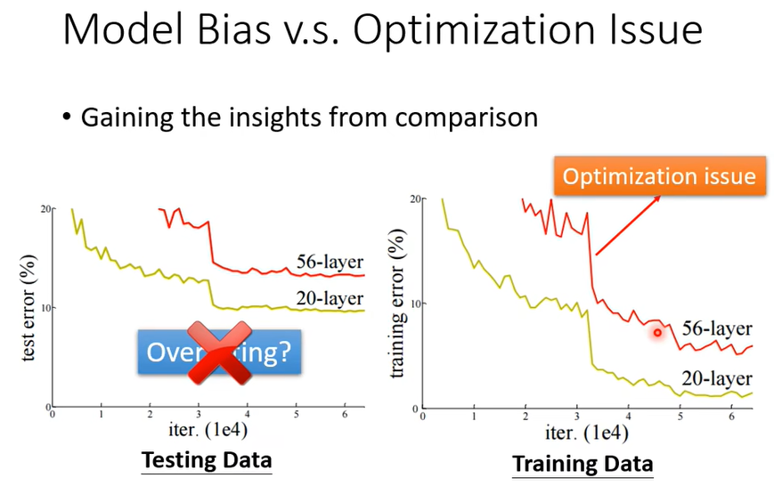

### 机器学习基本问题

*HW = homework*

#### 一、训练集上 Loss 大

##### 1）==model bias== **模型偏差**：

- 模型设计的过于简单，模型空间太小，真正的目标函数不在这个空间中。
  - 即使将当前模型训练到最优，Loss 值依然较大，依然无法逼近真正的目标函数。
  - 例如用**线性函数**去逼近**二次函数**。
  - 解决：重新设计模型，使模型更加复杂一些。
  - ==more feature== **更多特征**：例如使用前 28 天播放量，而非当天播放量
  - ==more neurons，layers== **更多神经元、更多隐藏层**：我们把激励函数称为神经元，所以可以像之前提及的多个 sigmoid 函数形式，通过增加神经元数量来取得过更好的效果。（同样也可以增加神经网络的层数）

##### 2）**优化欠缺**：没有把模型训练到很好。

- 如何判断是优化欠缺还是==model bias==？
  - 可以通过比较来获得帮助，**如果更多层的模型训练优化得到的 Loss 比较少层的模型更高，那么就是优化欠缺**。因为更多层只要完全复制低层次的部分，多出的层次简单的什么都不做，那么效果也会和低层次是一样的。
  - 所以我们可以先用**小规模模型**训练出一个较小的 Loss 值作为参考，协助我们进行判断。
  
- 我们之前提到梯度下降法，它的停止条件是**梯度为0**或**达到重复次数上限**。
- 那么**梯度为0**是否意味着达到最优呢？显然不是，存在局部最小值的问题。（后续会详细讲解）

#### 二、训练集上 Loss 小，测试集上 Loss 大

##### 1）==overfitting== **过拟合**：

- 举个极端的例子：模型最终训练成了，简单的把**训练数据的输入输出对应起来**，其余未知输入就生成随机值。那么模型在训练集上的 Loss 将会是 0，但显然这样得到的模型毫无用处。
- 其他类似的形式：通过了所有训练集上的点的曲线，但完全不贴和真实曲线。在测试集上也就一无是处。
- 这里我们先做个简单理解，显然上面的问题是训练集太小了，模型随随便便都可以生成一个通过 3 个点的曲线，或者说满足条件的曲线太多了，模型可能逼近的方向也就越多。所以**过拟合会很容易发生**。
- 解决：
  - 1.增加训练数据：显然是一个最直接有效的方法，往往越多的训练数据越能反映真实的曲线。
    - ==Data augmentation== **数据扩充**：在现有训练数据上进行一些扩展，例如：图像左右翻转，图像截取等；需要注意扩展时避免不正常的扩展，比如图像颠倒就很少使用到。
  - 2.==constrained model== **限制模型**：既然说可能满足训练集的曲线太多了，不妨限制一下模型的范围空间。
    - 比如上面的问题，假如我们事先限制模型是二次函数形式，那么过拟合发生的概率就会大大减小。
    - 如何进行限制呢？除了上述的直接限制模型形式，我们还可以：
    - 比如：**减少未知参数的个数**，或者进行共享参数(CNN)；**减少特征数量**(不是减少训练集，而是比如使用前 28 天的播放量并不比前 56 天的播放量效果差，那么可以减少特征数量，似乎实际上也是**减少了未知参数的个数**)；**早点停止训练**(过拟合往往是训练轮次过多容易发生的)；==**正规化**==；==**Dropout**== 层...
    - 但不要**限制过度**，否则是得不偿失，限制过度容易变成==model bias==，也即模型空间被限制的太小了。
- 模型的复杂度和 Loss 的关系图如下，我们期望寻找一个**在训练集和测试集都比较好**的模型，复杂度适中
- 交叉验证方法：

  - 实际中往往会设计多个模型，从中选择出较好的模型
  - 我们把训练数据划分为训练集和验证集，**验证集是用来训练模型的超参数**：**训练轮数**、**网络层数**、**学习率**等等。另外用验证集还可以监控模型是否异常（过拟合等等），以此绝定是否停止训练。
  - 设计不同超参数的模型(不同层数的网络，训练不同轮数等)，在训练集上训练后，在验证集上进行验证，以便从中**选择合适的超参数值**。
  - 原因：**测试样本往往不能以任何形式参与到模型的选择之中，包括超参数的设定，而仅仅用于模型评价**。
    - 因为如果把测试集作为验证集，以此调整超参数，那么很容易陷入调出一堆特定的超参数，但只适合测试集，只在测试集上表现很好，实际使用时一团糟。
    - 而设置验证集来调整超参数，就可以使用测试集去评估模型等等。
    - 但是千万不要**一直重复**使用测试集的反馈去调整对应的模型，否则就相当于把测试集并入了验证集。
  - N-折交叉验证：固定训练集和测试集可能会出现**划分上的问题**。
    - 把训练数据随机分成 N 份，其中一份作为**验证集**，其余作为训练集，进行训练。
    - 接下来再从其他 N-1 份中挑一个作为**验证集**，其余作为训练集，进行训练。
    - 这样的过程可以重复 N 次，每次的验证集和训练集都不同。求模型的平均 Loss 值。
    - 好处：1.减少划分上的误差；2.相比固定的 2 分划分，增加了训练集的大小。

#### 2）==mismatch== 不匹配

- 训练集和测试集**数据分布不一样**
- 俗话说：

>  谁知道明天和意外，哪一个先来。

- 现实中未来总会有变数，而机器总是死的，基于已有数据所进行的所谓“正确”的预测，也可能有比较大的错误。比如：
  - 基于2019年的全年旅行数据，预测2020年的旅行数据，结果必然是惨不忍睹，显然训练集和测试集的数据分布形式是截然不同的，因为疫情发生了。
  - 基于2021全年的对局数据，预测 Fpx 会是 S11 的夺冠概率最高的战队，但选手偏偏状态不好，最终 16 强出局。
- 这种问题我们是无法怪罪于模型的。

