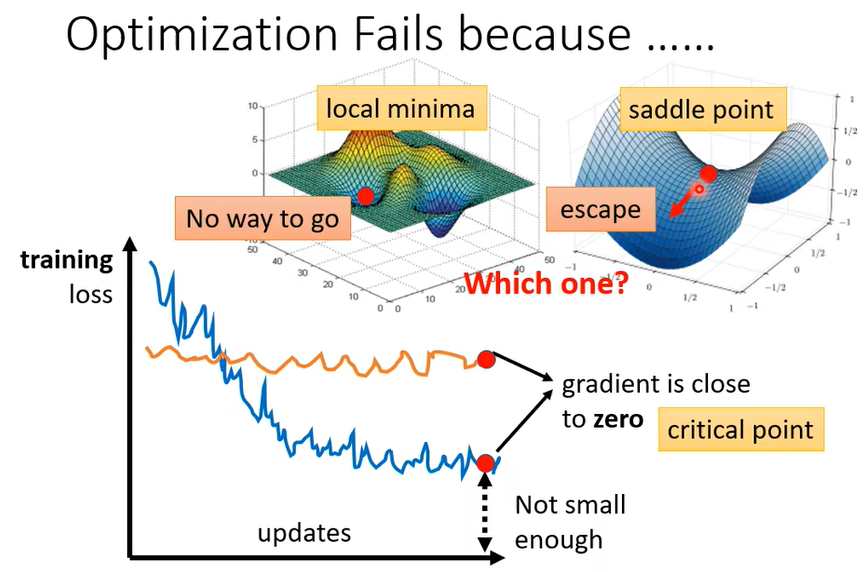
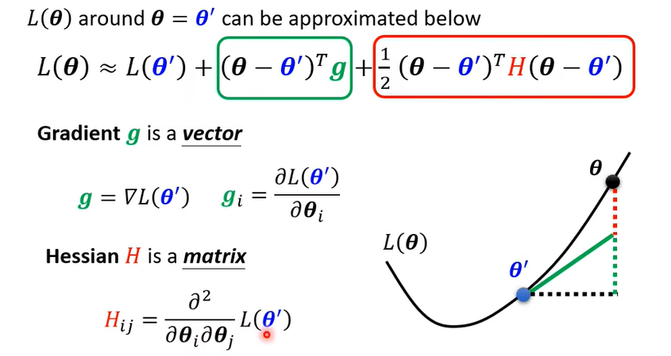
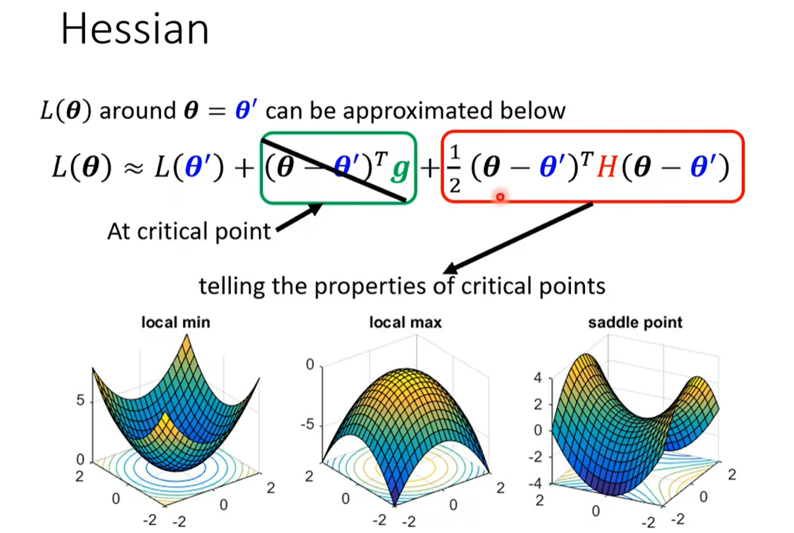
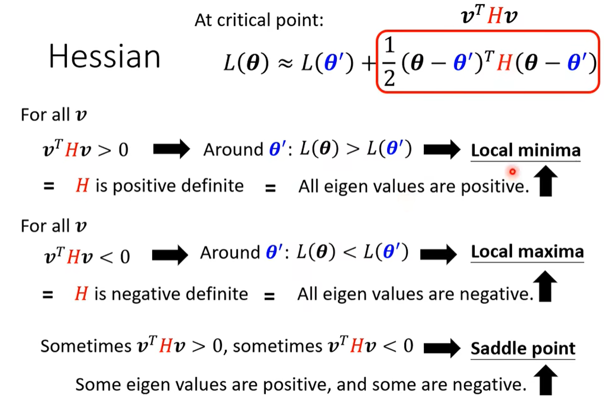
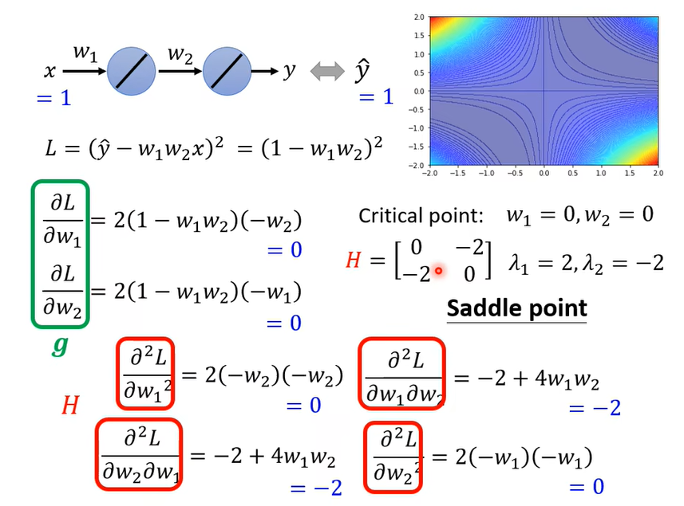
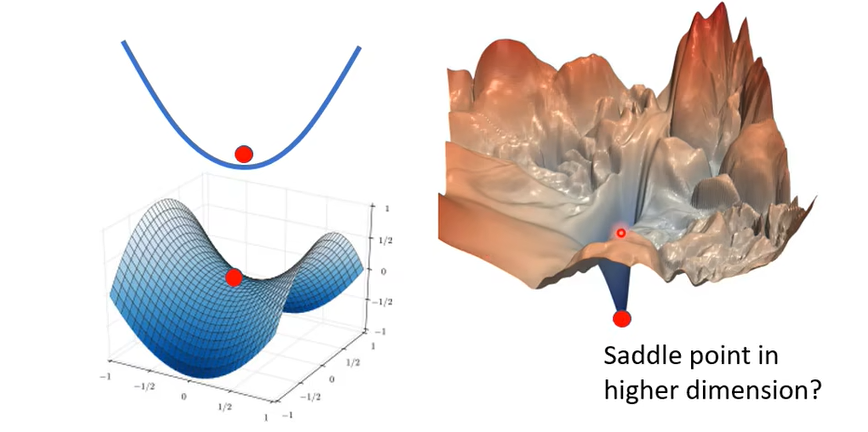
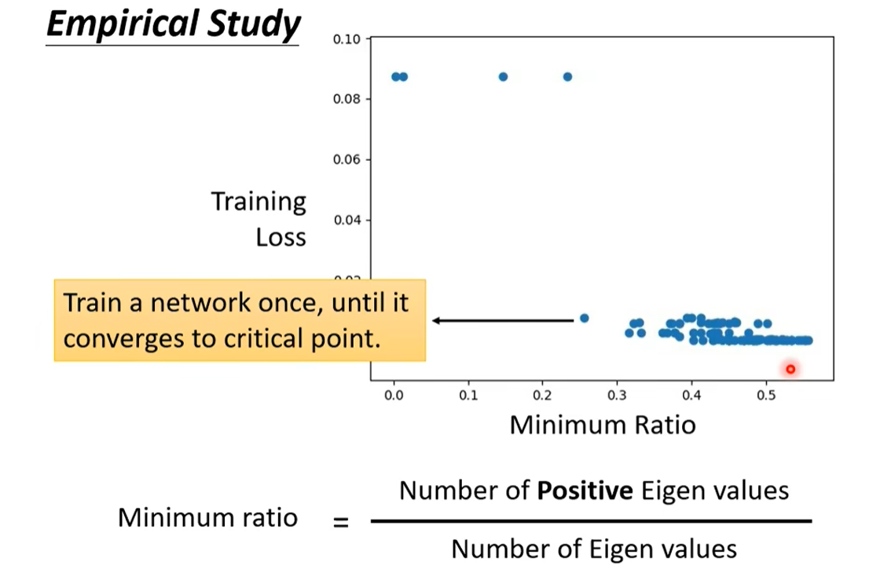

### 局部最小值(local minima)与鞍点(saddle point)

之前我们提到一个问题：

- 我们之前提到梯度下降法，它的停止条件是**梯度为0**或**达到重复次数上限**。
- 那么**梯度为0**是否意味着达到最优呢？
  - 我们说显然不是，因为存在类似局部最小值的问题。

- 或者说梯度很小的时候是否意味着优化效果比较好呢？
  - 不是，因为我们的目标是 Loss 值小，而非梯度小。

#### 梯度下降法存在的问题：

1、卡在==*critical point*==  **临界点**：梯度为 0 的点。

- 梯度为 0：局部最小值，全局最小值，==saddle point== **鞍点**。
- 由图知：(误差面图，Loss 函数图)
  - 如果卡在局部最小值，因为四周没有更低的 Loss，显然有些无能为力。
  - 但如果卡在鞍点，四周仍然有方向可以继续使Loss下降，那么还有继续优化的空间。
  - 所以能否解决这个问题的关键在于梯度下降卡在临界点时，到底是卡在了局部最小值，还是卡在了鞍点。

2、如何判断临界点的类型：

- Loss 函数一般很复杂，形状也会很复杂，我们无法知道 Loss 函数的形状，无法依据形状进行判断。
- 但在给定点 $\boldsymbol{\theta}=\boldsymbol{\theta}^0$ 的前提下，可以利用泰勒展开，近似表示出 Loss 函数在 $\boldsymbol{\theta}^0$ **附近**的函数形式。
- 这里的向量 $\boldsymbol{g}$ 是梯度向量；这里的 $\boldsymbol{H}$ 就是==**黑塞矩阵**==（函数 $L$ 在点 $\boldsymbol{\theta}^0$ 处的二阶偏导所组成的矩阵）
- 显然，卡在临界点时，梯度向量 $\boldsymbol{g}$ 为 0 向量，中间一项可省去。
- 那么我们考虑使用**红色方框中的项**来协助判断临界点的类型。卡在临界点时， $\boldsymbol{\theta}^0$ 就是临界点。

- 判断项的正负情况可以判断临界点类型：
  - 若对于所有附近的 $\boldsymbol{\theta}$ 值，项都为正，那么有 $\boldsymbol{L}(\boldsymbol{\theta})>\boldsymbol{L}(\boldsymbol{\theta}^0)$ 恒成立，也就是局部最小值。
  - 若对于所有附近的 $\boldsymbol{\theta}$ 值，项都为负，那么有 $\boldsymbol{L}(\boldsymbol{\theta})<\boldsymbol{L}(\boldsymbol{\theta}^0)$ 恒成立，也就是局部最大值。
  - 若对于所有附近的 $\boldsymbol{\theta}$ 值，项有正有负，那么就是鞍点。
  - 把代入所有附近的 $\boldsymbol{\theta}$ 值转变为判断矩阵 $\boldsymbol{H}$ 是正定\负定，再转化为判断矩阵矩阵 $\boldsymbol{H}$ 特征值(==*eigen values*==)的正负，会简化所需操作。                                                                 
  - 例：对于图中 Loss 函数，原点 $(0,0)$ 是一个梯度为 0 的点，通过计算矩阵 $\boldsymbol{H}$ 特征值，可以判断原点是一个鞍点。                                                       

3、判断好临界点类型后，如果卡住的临界点是鞍点，我们期望寻找新的更新方向。

- 矩阵 $\boldsymbol{H}$ 可以指明参数更新的方向。

- 我们期望向 Loss 值变小的方向更新参数，也就是要使 $\boldsymbol{L}(\boldsymbol{\theta}^1)<\boldsymbol{L}(\boldsymbol{\theta}^0)$ ，即：

$$
(\boldsymbol{\theta}^1-\boldsymbol{\theta}^0)^T\boldsymbol{H}(\boldsymbol{\theta}^1-\boldsymbol{\theta}^0)<0
$$

- 我们先计算矩阵 $\boldsymbol{H}$ 的负特征值相关的特征向量 $\boldsymbol{u}$，依据 $\boldsymbol{H}\boldsymbol{u}=\lambda\boldsymbol{u}$ 不难得到：

$$
\boldsymbol{u}^T\boldsymbol{H}\boldsymbol{u}=\boldsymbol{u}^T\lambda\boldsymbol{u}=\lambda\|\boldsymbol{u}\|^2<0 \space (\lambda<0)
$$

- 那么只需要使 $\boldsymbol{\theta}^1-\boldsymbol{\theta}^0=\boldsymbol{u}$，也即：

$$
\boldsymbol{\theta}^1=\boldsymbol{\theta}^0+\boldsymbol{u}
$$

- 使用 $\boldsymbol{\theta}^1=\boldsymbol{\theta}^0+\boldsymbol{u}$ 来更新 $\boldsymbol{\theta}$ 即可。
- ==这个方法实际上很少使用==，但是可以让我们理解，卡在鞍点是有解决方法的。

4、由上所知，当梯度下降法卡在临界点时，我们期望它是鞍点，那么实际上呢？

- 低维看起来的局部最小值，可能在高维是鞍点。

- 我们的机器学习往往维度非常非常多，也就是说卡在所谓的局部最小值的情况会非常少。

- 实际情况图如下：所有卡在临界点附近的模型的 minimum radio 与 Loss 值的关系图。

  - minimum radio：**正特征值所占比例**
  - local minima的情况是所有特征值都为正，所以图中越接近1代表越趋近local minima。

  - 故由图可知，实际中local minima的问题几乎很少遇到，而是常会卡在saddle point。

