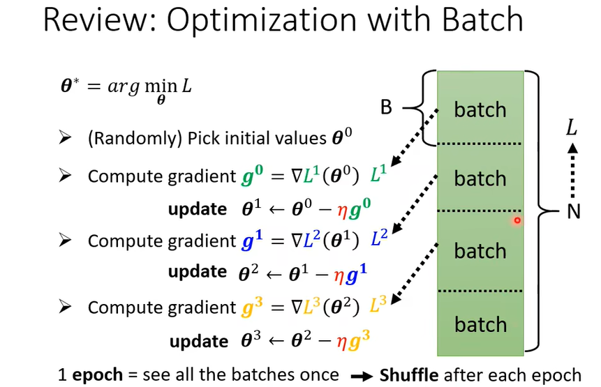
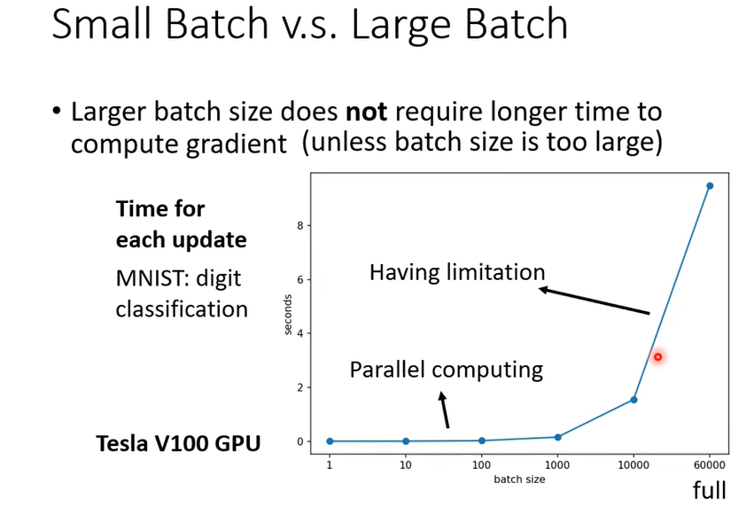
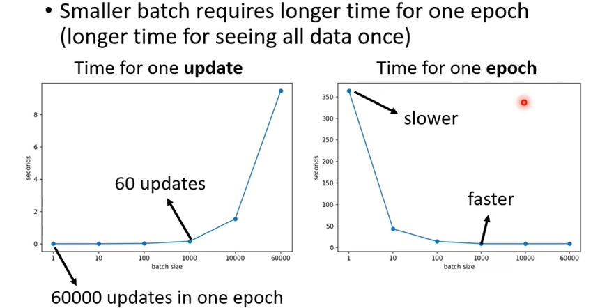
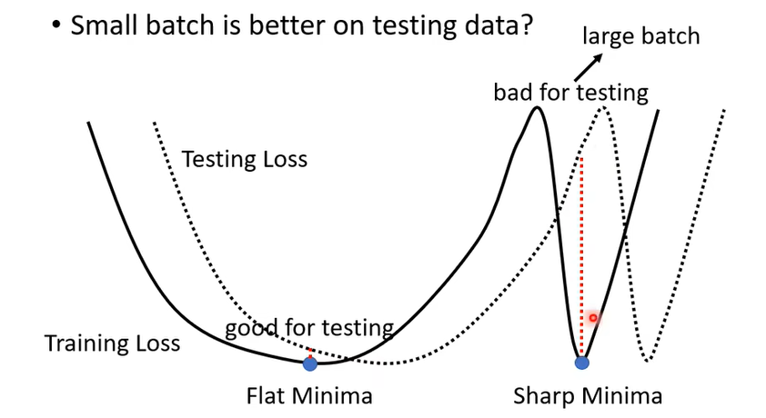
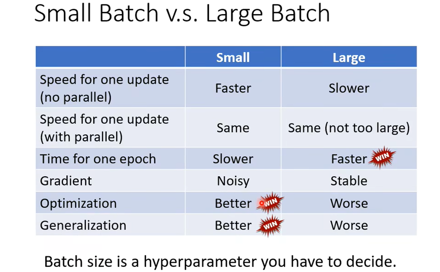
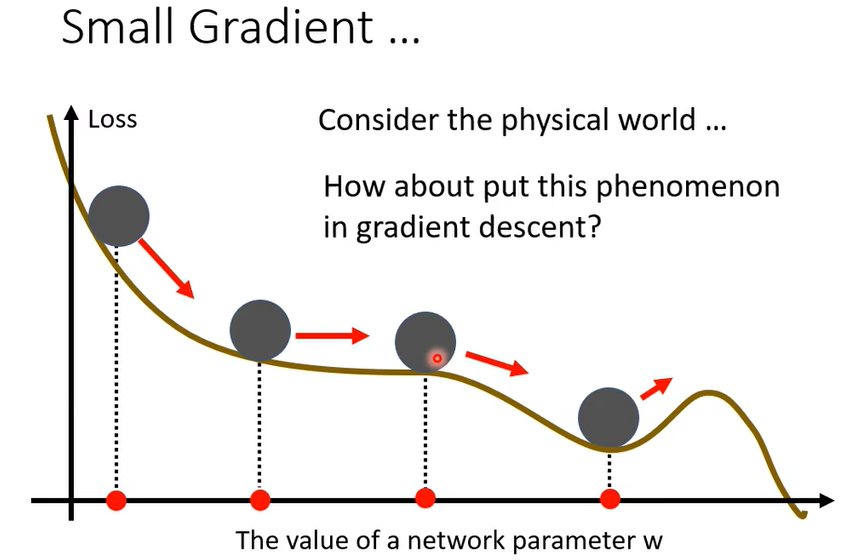
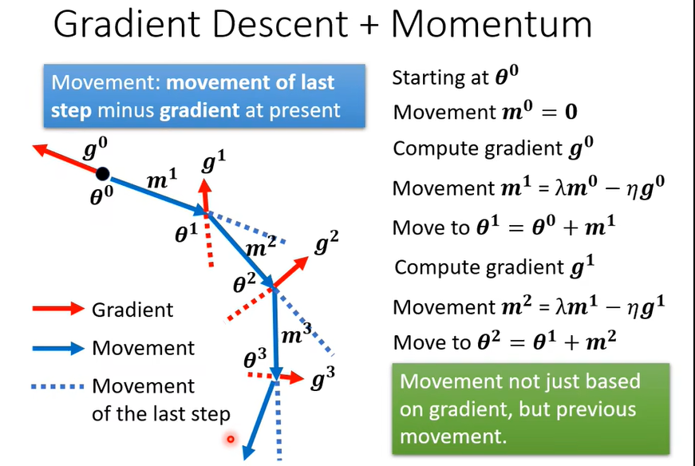
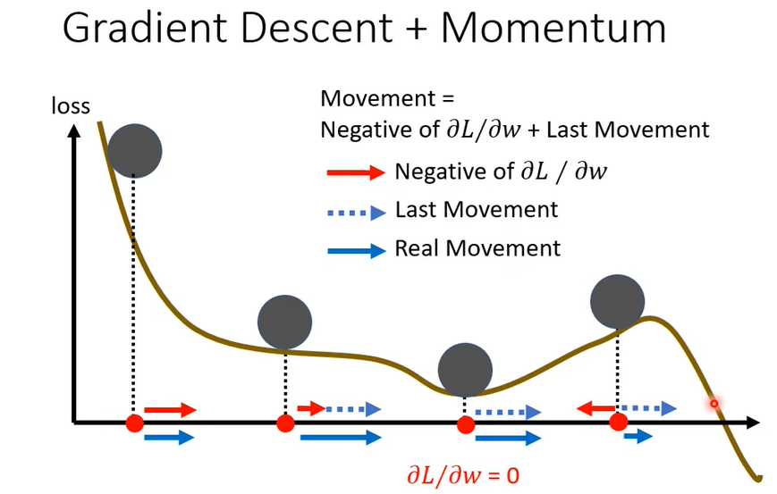

### 批次(batch)与动量(momentum)

1、==Batch== **批次**：

实际上，在定义损失函数时，我们会将训练资料**随机**分为多个 ==batch== **批次**，对于每一个批次单独进行处理，分别计算其损失函数 $L^i$ ，然后在对每一个 $L^i$ 计算梯度 $\boldsymbol{g}^i = \nabla L^i(\boldsymbol{\theta}^{i-1})$ ，并用此梯度更新参数向量 $\boldsymbol{\theta}$ 。

- 将所有 batch 都训练完后，称为完成一个 ==epoch==（轮次）
- 每一轮 epoch 后，进行一次 ==Shuffle== **洗牌，将训练模型的数据集进行打乱的操作**

2、为什么使用 Batch？

- 极端的**每一个数据作为一个 Batch，进行一次更新**和**所有数据作为一个 Batch ，等同于不使用Batch**

- 通过比较 ==small batch== 和 ==large batch== 来了解 Batch。

- 我们可能习惯的认为，large batch 由于需要一次处理比较多的数据，可能对于处理==一个 batch== 来说，进行**一次更新**所需要的时间会更长。

  - 实际上在考虑**并行运算**(GPU)的情况下，在一定范围内，Btach size 的大小并不会显著的影响**一次更新所花**的时间。
  - 当然，如果一个 Btach 大小超过并行计算的限制的话，确实会显著增加更新时间。

  - 既然在一定范围内，Btach size 的大小并不会显著的影响**一次更新所花**的时间。那么，在这个范围内，对于 ==1  个 epoch==，batch size越大，batch 个数越少，所需更新时间也就越少。

- 这么看来，似乎在一个范围内，我们应该选择尽量大的 batch size。即提高速度，又提高GPU利用率。

3、实际上：

- 尽管 batch size 越大，处理一个 epoch 速度越快，但同时，需要达到同样精度所需的 epoch 数量也越多。(1 个 epoch 的更新次数变少)
- 过大的 batch size 导致**模型泛化能力下降**。
  - 研究表明大的 batch size 收敛到 sharp minimum，而小的 batch size 收敛到 flat minimum，后者具有更好的泛化能力。sharp minimum 使得测试集的 Loss 函数稍有不一样就会有比较差的结果。
  - 原因是小的 batch size 带来的噪声有助于逃离 sharp minimum。
  - 因为小的 batch size 带来的 Loss 函数数量也会很多，更新次数也会变多。
  - 而且因为 batch 比较小，Loss 函数之间差异往往较大。函数形状不一样，更新参数时更不容易卡在 sharp minimum，因为只要下一个 batch 的 Loss 函数稍有不一样，就会逃离 sharp minimum。

4、small batch 与 large batch 的对比：

- 没有平行运算时，small batch 一次更新的速度更快；
- 有平行运算时，两者速度基本相同，前提是 batch 不要太大。
- 1 个 epoch 的处理上说，large batch 速度更快。
- 优化和泛化效果来说，small batch 稍占上风。

所以 batch size 是一个比较重要的 ==hyperparameter== **超参数**，需要自己去调整。

6、==momentum== 动量：使用前一步的移动影响当前移动。

- 以物理中的动量为例，当小球滚动到局部最小值时，还有一个向右的动量，会继续向右滚动，有可能逃出局部最小值；
- 而若使用梯度下降法，我们会在局部最小值(梯度为 0)的地方停下。

- 一般的梯度下降法的参数更新：$\boldsymbol{\theta}^{i+1} \leftarrow \boldsymbol{\theta}^i - \eta\boldsymbol{g}^i$ 
- 在这里引入 movement 变量 $\boldsymbol{m}$，表示当前一步的移动。其中：$\boldsymbol{m}^{i+1}=\lambda\boldsymbol{m}^i - \eta\boldsymbol{g}^i$
- 参数更新：$\boldsymbol{\theta}^{i+1} \leftarrow \boldsymbol{\theta}^i+\boldsymbol{m}^{i+1}=\boldsymbol{\theta}^i - \eta\boldsymbol{g}^i + \lambda\boldsymbol{m}^i$ ，使用到了上一步的移动。
- 实际上是使用了前述所有计算的梯度 $\boldsymbol{g}^i$。

- 图示：使用 momentum 也许可以跳过局部最小值。

