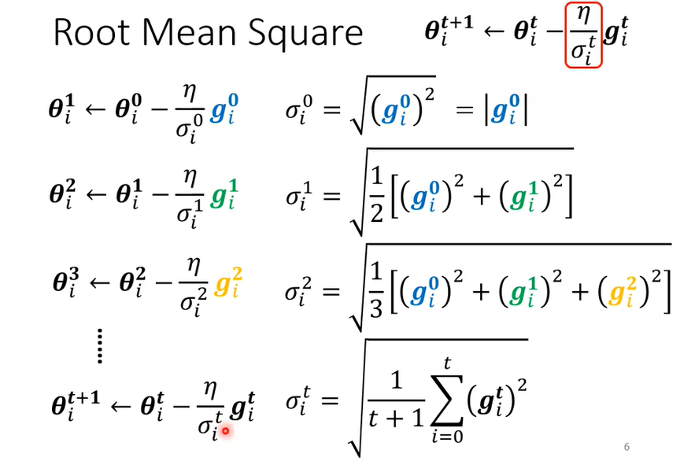

### 自动调整学习速率(Learning Rate)

1、训练停滞不前的问题不止是卡在临界点。

- 人们认为训练停滞不前是因为参数卡在临界点附近，但往往在梯度没有下降为趋近0的时候，损失值loss就趋近平稳，交叉熵达不到临界点。
- 例如图示，训练卡住时 Loss 值无法下降，但梯度值却会反复横跳。

2、为什么会发生这样的问题呢？显然，是“步伐”太大，根本没法走到临界点附近。那么如何减小“步伐” ==$-\eta\boldsymbol{g}$== 呢？

- 发生上述的问题，显然想通过减小梯度 $\boldsymbol{g}$ 来减少“步伐”是不太可能的，因为我们无法改变损失函数曲线来改变震荡处的梯度值。
- 我们能改变的只有“步伐”中的 ==hyperparameter== ，**学习率** $\eta$。

- 一个**固定**的学习率往往会导致上述的问题，学习率太大就可能会导致不停的在临界点的两边震荡；但学习率太小又可能会导致当梯度也很小时，“步伐”会变得非常小，“永远”达不到临界点。

3、那么自然而然，我们会想到，能不能动态调整学习率呢？

- 显然梯度变化较大的需要更小的学习率，减小”步伐“；
- 梯度变化较小的需要更大的学习率，增加“步伐”。

- 引入额外参数 $\sigma^t_i$ ：下标 i 表示取向量中第 i 个数为例；上标 t 表示第 t 次更新参数。
- 使用参数 $\sigma^t_i$ 来动态调整学习率。

4、显然要根据梯度大小来动态调整学习率，参数 $\sigma^t_i$ 一定和梯度有关。

- 我们使用前述所有的梯度的 ==*root mean square*==  **均方根**

- 当loss曲线平缓，梯度小，参数 $\sigma^t_i$ 变小，那么 $\frac{\eta}{\sigma^t_i}$ 变大，”步伐“也就变大。

- 当loss曲线陡峭，梯度大，参数 $\sigma^t_i$ 变大，那么 $\frac{\eta}{\sigma^t_i}$ 变小，”步伐“也就变小。

5、在上述方法中，我们认为所有梯度值都有同样的重要性，但实际肯定不是这样。

- 想象一下，在平地骑行的你，突然遇到一个陡坡，我们期望肯定是马上减缓速度，以免速度过快发生危险。
- 如果之前平地的**小的梯度值**有**一定数量**的话，突然增大的一个或几个梯度值往往并不会对参数 $\sigma^t_i$ 造成很大的影响，步伐很可能一段时间都不能降下来，显然不是我们期望的。

- 所以我们会想要自己去设置不同时期的梯度值的权重。
- ==RMSProp== 方法就引入额外参数 $\alpha$ 来调整**最近梯度值与之前梯度值**的重要程度，由于是我们自己设置的， $\alpha$ 也是一个 ==hyperparameter== **超参数**。

- 例如，如果我们认为最近的梯度值具有更大的影响力，那么我们设置一个较小的 $\alpha$ ，增大最近梯度值的影响力。
  - 在图中，当突然遇到陡坡时由于最近梯度值影响力大，大的梯度值会马上使参数 $\sigma^t_i$ 变大， $\frac{\eta}{\sigma^t_i}$ 变小，”步伐“变小；突然遇到平地会马上使参数 $\sigma^t_i$ 变大， $\frac{\eta}{\sigma^t_i}$ 变小，”步伐“变大。

6、假设所有梯度值都有同样的重要性的方法还会引发另一个问题：突然”爆炸“。

- 由于采用所有计算的梯度值同等重要方法，对于==y轴方向的参数==来说，一开始梯度值比较大，那么 $\sigma^t_i$ 也会比较大，那么 $\frac{\eta}{\sigma^t_i}$ 会变小，步伐也会慢慢变小。
- 之后当 $y$ 轴方向的梯度值变得较小时，由于前面一些梯度值大的点的影响的关系， $\sigma^t_i$ 也会==**慢慢**==变小， $\frac{\eta}{\sigma^t_i}$ 会==**慢慢**==变大，步伐也是**慢慢变大**。
- 但这样的在 $y$ 轴方向较小的梯度值个数越来越多时，累积一定程度后， $\sigma^t_i$ 变的足够小，$\frac{\eta}{\sigma^t_i}$ 变得足够大，步伐也就突然变大，在y轴方向产生震荡。
- 同时又由于梯度值变大，那么 $\sigma^t_i$ 又变大，步伐又慢慢变小，直到出现足够多能够平衡前述梯度值影响的梯度值后，又回归到平稳。
- 之后的情形类似。

- 如何解决这个问题呢？

  - ==Learning Rate Scheduling== **学习率调度**。
    - 例如：==learning rate decay== **学习率衰减**，随着训练进行不断减小 $\eta^t$ 值，可以解决上述问题。
      - 因为随着训练的进行，我们离终点越来越近，于是可以放慢学习率。
      - 所以可以实现虽然 $\sigma^t_i$ ==**慢慢**==变小，但 $\frac{\eta^t}{\sigma^t_i}$ 不一定变大。
      
    - 又比如：==warm up==，随着训练对 $\eta^t$ 先增后减
      - 可能的原因：由于刚开始没有数据基础，$\sigma^t_i$ 方差很大，容易被最开始的几个数据改变的太多。所以一开始的 $\eta^t$ 很小，让学习率一开始比较小，先在初始位置附近收集一些数据，然后再开始慢慢增加 $\eta^t$ 来正常训练。
      - 应用在许多模型：例如==Transformer==。

7、在此对前述在优化时使用到的方法进行一个总结：	

- mementum 动量：计算时使用到前述所有梯度值，但是要考虑梯度的方向。
- $\sigma^t_i$ 参数：前述所有梯度值的均方根（或带参数 $\alpha$ ），只考虑大小。
- $\eta^t$：学习率调度

综合使用上述方法来进行参数的更新。

