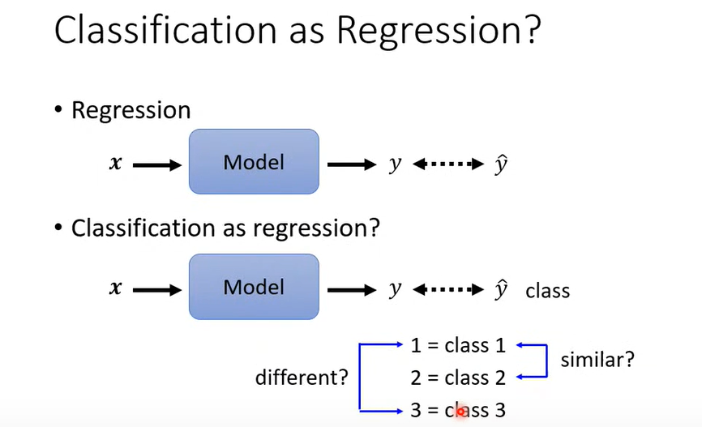
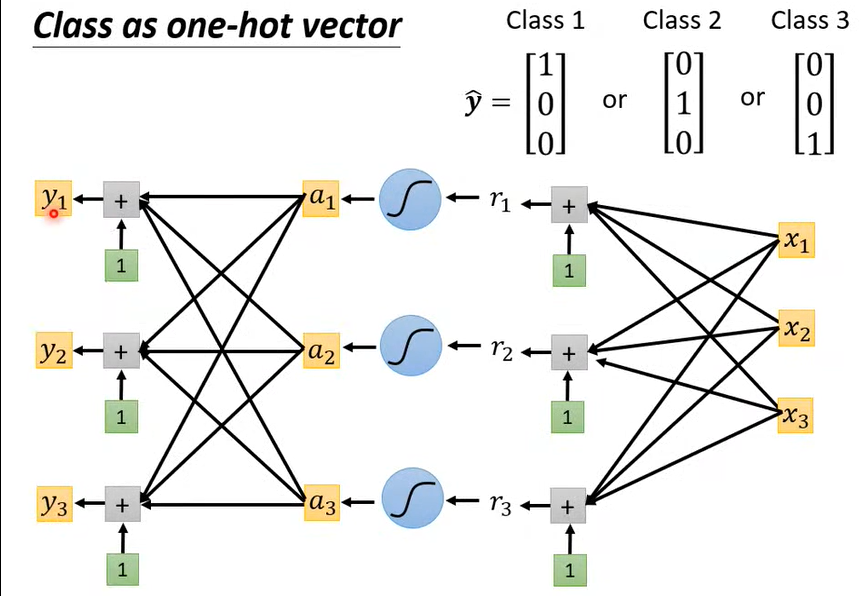
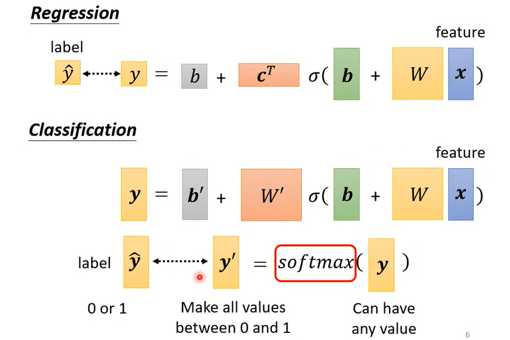
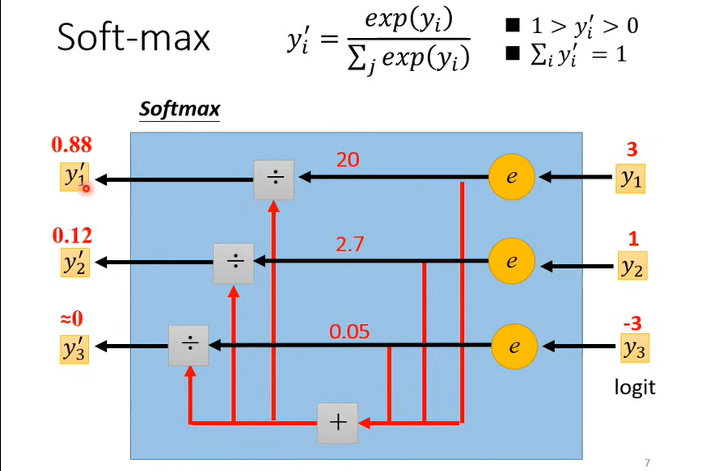
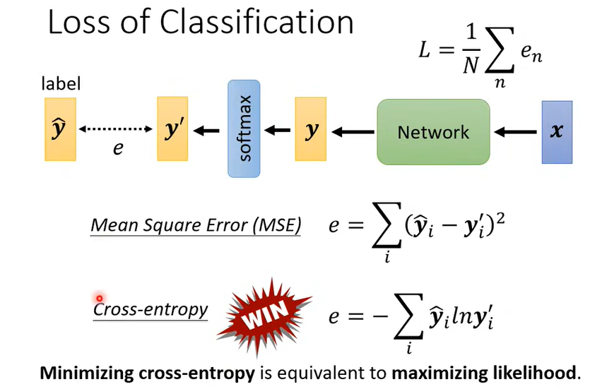
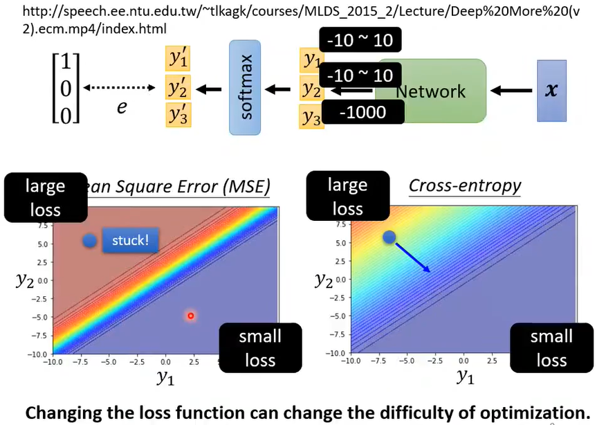

### 分类(classification)

1、分类和回归

分类和回归本质都是一样的，对输入做预测，都是监督学习，即根据特征，分析输入的内容，判断它的类别，或者预测其值。区别在于：

- 输出不同

  - 分类输出的值是==离散的==，回归输出的值是==连续的==；（但不是严格意义上数学的连续和离散）

  - 分类输出物体的==所属类别==，回归输出物体的==值==；

  - 分类输出的值是==定性的==，回归输出的值是==定量的==；

- 目的不同

  - 分类是为了寻找==决策边界==，回归是为了找到==最优拟合==

- 结果不同

  - 分类问题结果==对就是对，错就是错==；回归问题是对真实值的一种==逼近预测==

2、分类也可当作回归？

如果把类别用数字来表示，可近似回归，例如：$class 1 = 1$、$class 2 = 2$、$class 3 = 3$。

但这样的表示会存在问题，例如在数字中我们通常认为 1 和 2 相对接近，1 和 3 相对较远，对于类别来说，可能存在这样的情况，例如：

- 类别1、2、3分别为1、2、3年级学生的身高，那么这样表示似乎就没有问题；

- 但若类别之间并无接近一说，那么简单的数字表示就会出现问题。

2、解决：==One-Hot编码==，又称为一位有效编码，主要是采用 N 位状态寄存器来对 N 个状态进行编码，每个状态都由他独立的寄存器位，并且在任意时候只有一位有效。使用 one-hot 编码，将离散特征的取值扩展到了==欧式空间==。在欧式空间中的任意两个类别的欧式距离都是 $\sqrt{2}$ ，即类别之间没有接近一说的关系。

3、问题：采用上述表示方法后，类别使用了 ==one-Hot编码== ，但是输出结果向量 $y$ 往往无法归类到类别向量上。

解决：分类的最后一层==使用 softmax 函数==进行判断其所属类别。

4、softmax函数：将可以为任何值的 vector 映射为 ==vector 内每个值属于$(0,1)$,所有值之和等于 1== 的向量,可以理解为==概率==。

比如下图中 vector $[3, 1, -3]$ 经过softmax处理后变为$[0.88, 0.12, 0]$ ,那么这个图片属于第一类的$P = 0.88$。

softmax函数的作用可以理解为让大值与小值间的差距更大，因为做了取幂运算。

*另外：在二分类问题中，sigmoid 函数和 softmax 函数效果相同*

sigmoid函数：$output(x_1)=\frac{1}{1+e^{-x_1}}$

softmax函数：$output(x_1)=\frac{e^{x_1}}{e^{x_1}+e^{x_2}}=\frac{1}{1+e^{-(x_1-x_2)}}$

将$x_1-x_2$用$z_1$代替，那么转化为$output(z_1)=\frac{1}{1+e^{-z_1}}$，形式上是一样的。

5、分类问题的损失函数：使用==交叉熵==而非平方差。

（Why？[分类问题为什么用交叉熵损失不用 MSE 损失](https://blog.csdn.net/wxc971231/article/details/123866413?spm=1001.2101.3001.6650.6&utm_medium=distribute.pc_relevant.none-task-blog-2~default~BlogCommendFromBaidu~Rate-6-123866413-blog-102621605.pc_relevant_default&depth_1-utm_source=distribute.pc_relevant.none-task-blog-2~default~BlogCommendFromBaidu~Rate-6-123866413-blog-102621605.pc_relevant_default&utm_relevant_index=10)、[各类损失函数](交叉熵作为损失函数还有一个好处是使用sigmoid函数在梯度下降时能避免均方误差损失函数学习速率降低的问题，因为学习速率可以被输出的误差所控制。)）

> 1. MSE 损失主要适用与回归问题，因为优化 MSE 等价于对高斯分布模型做极大似然估计，而简单回归中做服从高斯分布的假设是比较合理的
> 2. 交叉熵损失主要适用于多分类问题，因为优化交叉熵损失等价于对多项式分布模型做极大似然估计，而多分类问题通常服从多项式分布

- ==最小化交叉熵等同于最大化似然性(相似性)==。交叉熵可以衡量==真实类别的分布==和训练后==预测类别的分布==之间的相似性。
  - 在语言模型中（NLP）中，由于真实的分布是未知的，在语言模型中，模型是通过训练集得到的，交叉熵就是衡量这个模型在测试集上的正确率。即测试集作为==真实分布==，模型在训练集上训练后对测试集的预测结果作为==预测分布==。

6、不同的损失函数存在不同的误差面：

- 针对这个分类问题，MSE损失函数的误差面在左上角的梯度很小，刚开始的学习速率会很低，但实际上左上角的 Loss 值却是相对很大的，应该去提高它的”步伐“。

- 而对于交叉熵来说可以让 Loss 值大的地方梯度也较大，可以从一开始就有比较大的学习速率。

