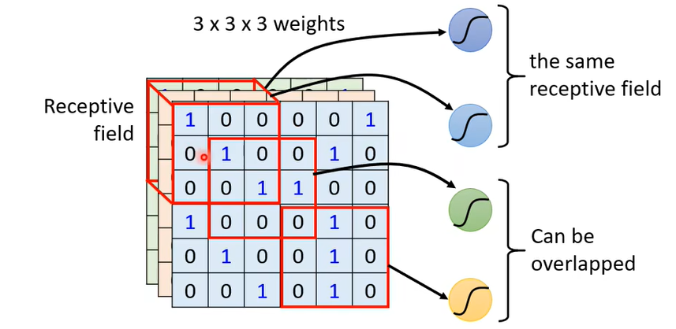

### 卷积神经网络(Convolutional Neural Network)

#### 介绍一

1、以图像识别为例，这是一个**分类**问题，而我们已经知道：

- 在输出方面：

  - 类别可以用 ==one-hot== 编码表示成向量形式。

  - 输出 $y$ 经过 softmax 函数变成 $y'$ ，可以变成一个展示和各个类别相似概率的向量。

  - 可以使用 ==cross-entropy== **交叉熵**作为损失函数计算 Loss 值。

- 输出方面似乎暂时没有问题，那么在输入方面，我们该如何表示图片输入呢？
  - 我们之前提到的模型输入都是**向量格式**，我们期望把**图片输入也变成向量形式**。
  - 计算机通常把一个 Image 图片理解为一个三维的 tensor，一个三维的 tensor 可以看作是一个三维的矩阵，有 C、H、W 三个维度。
    - CHW 格式：C 为通道(channel)，H 为高度，W 为宽度。默认的 tensor imge 为 3HW。
    - 3 通道图片一般为 RGB 格式，即红、绿、蓝三原色。
    - 我们理解为每一个通道有一个 $高*宽$ 的矩阵，矩阵对应位置的值表示**通道的原色**在该点的强度值。
  - 那么我们把这三维的 tensor 拉直成一维向量，似乎就能够作为神经网络模型的输入了。

- 我们把之前我们学到的模型称为 ==Fully Connected Network== **全连接网络**。

  - 把处理好的图片向量作为全连接网络的输入。以上图为例，向量长度是 $100*100*3$ 

  - 假设第一层的神经元（激励函数）共有 1000 个，那么第一层的权重参数 $w_{ij}$ 将会有 $i*j=100*100*3*1000=3\times10^7$ 个。

  - 如此之多的未知参数会严重增大模型的空间大小。
  - 对于图像识别，**全连接网络**似乎不太适用。    

2、那么怎么**针对图像识别**去优化这个网络呢？

- 全连接网络中每一个神经元都接受了所有的输入，在图像识别中似乎并不需要。

  - 以人为例，观察下面这张图片，你会不会有一瞬间以为这是一只乌鸦呢？
  - 为什么会产生这样的错觉？因为我们人眼去识别图中动物的时候，往往更加注意的是某些**关键的模式**，例如眼睛、嘴巴之类的，旁边的地板对于我们判断动物的类别来说似乎没有什么帮助。
  - 对计算机来说，去尝试发现图像里的某些**模式**似乎也是一种优化方案。

  - 神经元也许并不需要整张图片作为输入，可能只用一小部分作为输入，就能够去甄别有没有出现一些**关键的模式**。

3、如何实现？

- 每个神经元只分配部分图片输入，称为一个 ==receptive field== **感受野**，只需要处理这个 receptive field 里发生的事即可。
  - 将这个 receptive field 里的三维 tensor 拉直为一维向量作为输入，那么神经元只需要 $3*3*3=27$ 个权重以及一个 bias 偏移，处理后输出给下一层的神经元。

- receptive field 由自己设定：

  - 包括大小，形状。

  - 同一个 receptive field 可以作为多个神经元的输入。

  - 不同神经元的 receptive field 的大小也可以不同。

  - 不同神经元的 receptive field 可以重叠。
  
  - 可以只针对某些通道设置 receptive field。（当某些模式只存在于某个通道中）

- 经典的 receptive field 设定：

  - 考虑所有通道，等同于只需要设定高度和宽度。
    - 设定的 $H\times W$ 称为一个 ==kernel size==，比较常用的是 $3\times3$ 。
    - 这么小的 ==kernel size== 会不会导致无法观测到大一些的**模式**呢？其实不会，如果设置多层卷积的话。（后面会提）
  - 每一个 receptive field 都会有**一组神经元**去观测。（32、64...）

  - 一般会将 receptive field 做简单的上下左右**平移**后作为下一个 receptive field ，平移距离称为 ==stride==。
    - 如果平移后的 receptive field 超出图像范围，把超出地方补 0，称为 ==padding== **填充**。
  - 所有的 receptive field 加起来覆盖**整张图片**。

4、考虑出现另一个问题：

- 显然每张图片的所谓关键模式往往是可以出现在不同的区域。

  - 我们提到一般一个 receptive field 都会有**一组神经元**去观测，所以似乎需要在每一个 receptive field 都有一个能识别某个关键模式的神经元才能做到万无一失。
  - 但是如果简单的这样做，显然参数又会变得非常多。

- 这里，我们回想之前提到过的限制模型空间的一个方法，==共享参数==，我们曾经说它是 CNN 里用到的，那么现在它来了。

  - 我们可以让观测不同 receptive field 的神经元具有相同的权重参数。
    - 那么如果出现同一个模式，两个神经元的输出会是相似的。
  
  - 让不同 receptive field 的一组神经元共享参数，并把共享的参数称为 ==filter x==。

5、总结卷积层：

- 在全连接的基础上，添加 receptive field 限制，然后再增加参数共享。
- 实际上减少了未知参数个数，限制了模型空间，故卷积层也具有相对较大的 ==model bias== **模型偏差**。
- 使用卷积层的网络叫做卷积神经网络。
- 尽管卷积层有较大的 model bias，但卷积层在图像识别中具有更好的效果，使用卷积层常常需要以下特点：
  - 一些关键模式**比整张图像小**很多。
  - 同一种关键模式可能出现在**不同的区域**中。

#### 介绍二

1、什么是卷积层？

- 我们把卷积层定义为，其中有许多个 filter ，大小为 $3\times3\times channel$ 的矩阵。
  - filter 里的数值实际上都是模型里的**未知参数**。

2、以 1 个 channel 为例，使用每一个 filter 从图像中捕获数据（我们又称之为**卷积**操作）：

- 每次从图像中捕获一个 $3\times3$ 大小的部分，与 filter 中对应位置进行相乘并求和。

- 做上下左右平移，捕获下一个 $3\times3$ 大小的部分，继续相乘求和，最终构成一个矩阵。
- 这里的 filter 是如何识别**模式**的呢？
  - 如图，filter 1 的对角线都是 1 ，我们可以看成它的作用是识别对角线为 1 的 $3\times3$ 模式。
  - 在图像中，满足条件的模式存在于左上角和左下角。
  - 在经过 filter 1 捕获后形成的矩阵中，在左上角和左下角的数值最大。
- 每一个 filter 都能获得一个矩阵。最终获得多个矩阵，我们称之为 ==feature map==  **特征图**。

- 如果把第一层卷积层得到的  ==feature map== 作为第二层卷积层的输入：

  - 那么想当于一个 $4\times4\times64$ 的图像输入，也就是说，第二层卷积层的 filter 的大小应该是是  $3\times3\times (channel=64)$ 。                          

  - 如果多增加几层卷积层，捕获到的  ==feature map== 的高度和宽度会越来越小，channel 越来越大。
  - 那么对于可能存在于较大区域的**模式**，就可以被压缩到 $3\times3$ 的区域里，也就是说 kernel size 设置为 $3\times3$ 不会存在较大区域的模式识别不出来的问题。

#### 比较

- filter 意义类似：都是指模型中的共享参数

- 介绍二中共享参数的表示形式：
  - 用**同一个 filter** 扫过**不同的 receptive field** ，等同于不同的 receptive field 的神经元之间**共享参数**。

#### 池化 Pooling

- 前提：对像素进行二次采样（Subsampling）不会改变对象
  - 例如：把图片的偶数列和奇数行去掉，缩小了图片，但似乎没有改变图中物体的样子。

- Pooling：本身没有参数，不属于一个 layer 、一层。例如：
  - 最大池化：从一个区域里面取最大的一个数。
- 池化作用：
  - 常用于卷积层之后，继续压缩图片。(减少运算量)
  - 实际中卷积和池化常会交替使用。                 

- 显而易见的问题：
  - 池化可能会导致图像损失一些特征。
  - 随着计算速度越来越快，很多人已经选择不使用池化。

#### 最终使用的神经网络全貌

- 把图像输入 **卷积池化层** ，得到压缩后的输出
- 把 **卷积池化层** 的输出进行 ==Flatten== **压平，拉直**后输入全连接层
- 全连接层的输出再通过 softmax 层，得到最终结果

- CNN 对放缩后和旋转后的图片不那么有效，因为会极大的改变**关键模式的向量表示**。
  - 例如：假设眼睛的向量表示是斜对角线的全 1 矩阵，那么旋转后可能后变成竖排或横排的全 1 矩阵，那么对于之前能识别眼睛模式的  filter 可能就不再管用。
  - 所以我们需要数据增强，如我们之前提到的：
    - ==Data augmentation== **数据扩充**：在现有训练数据上进行一些扩展，例如：图像左右翻转，图像截取等；
    - 让 CNN 有一个对处理后图片中关键模式的识别能力。
  

#### CNN在围棋中的使用

1、分类问题：输入是**当前棋局**，输出是**下一步棋局**，也即**下一步棋子位置**。

- 把棋盘等效于一个 $19\times19$ 长度的向量，那么棋盘的每一种棋局都可以作为一个类别。
- 如果把输入的当前棋局视为一个图像，这个图像的大小应该是 $19\times19\times48$，这里通道为 48 是考虑了棋子可能代表的状态。

2、我们提到卷积神经网络使用需要一定的前提，使用卷积层常常需要以下特点：

- 一些关键模式**比整张图像小**很多。
- 同一种关键模式可能出现在**不同的区域**中。

围棋似乎具有类似的特点：

- 某些棋子的存亡只取决于周围的一部分
- 棋子可以落于棋局中的任意位置

3、显然棋局中是**无法使用池化**的，会大大改变原有棋局的局势。