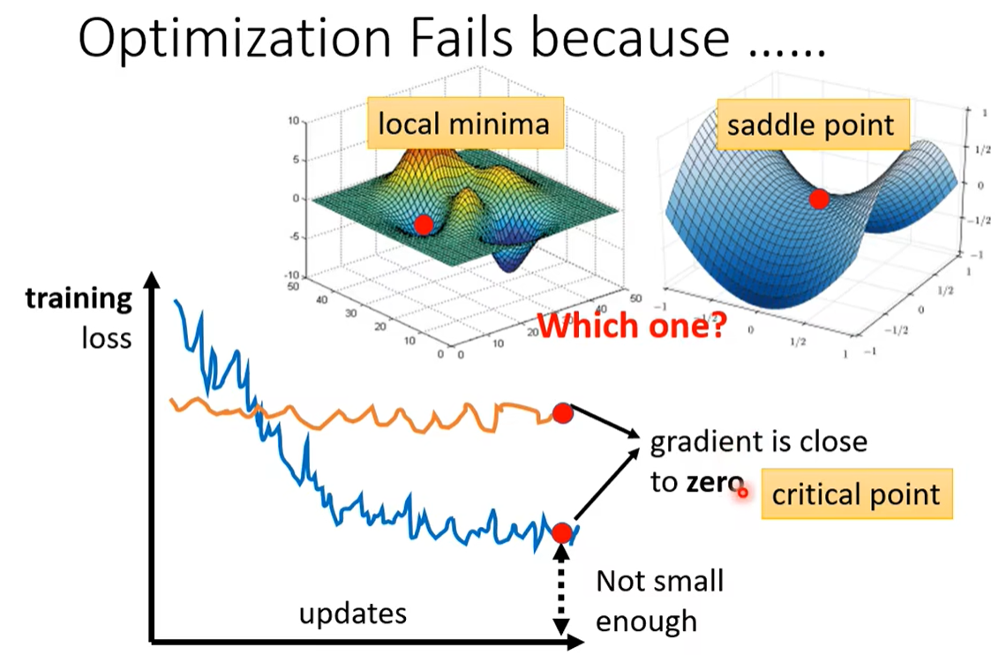
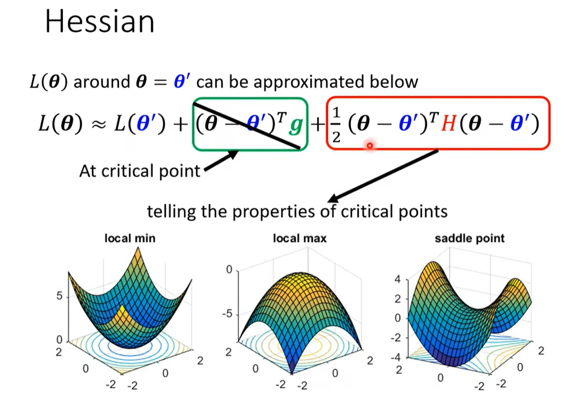
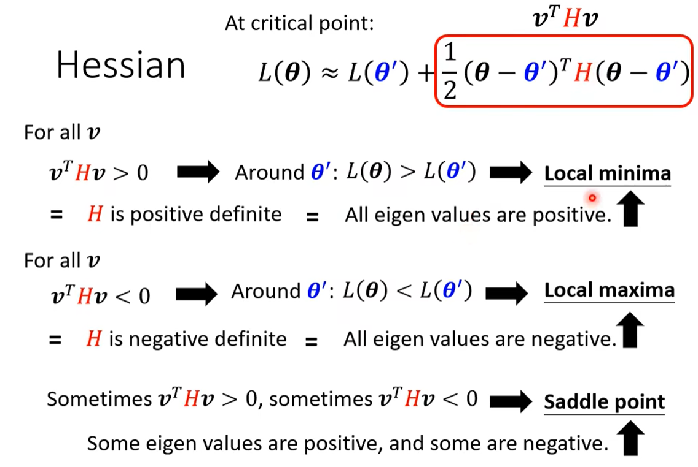
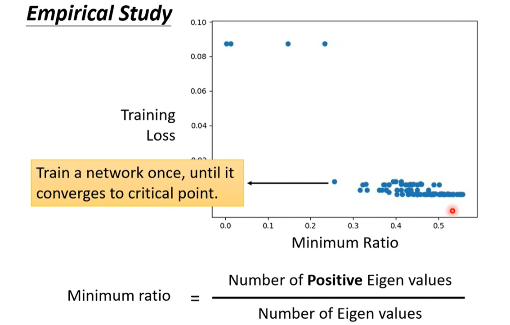

### 局部最小值(local minima)与鞍点(saddle point)

==*critical point*  临界点==

1、黑塞矩阵：泰勒级数逼近

2、临界点：局部最小值、局部最大值、鞍点

==*positive definite*  正定（矩阵）==

3、minimum radio：依据上述定义，表示的是趋近局部最小值的程度，越接近1越趋近local minima。

 故由图可知，实际中local minima的问题几乎很少遇到，而是常会卡在saddle point。

==*eigen values*  特征值==

