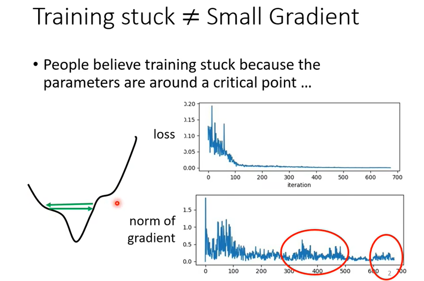
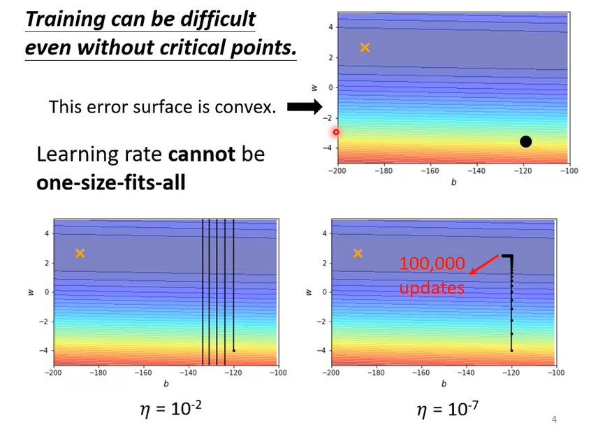
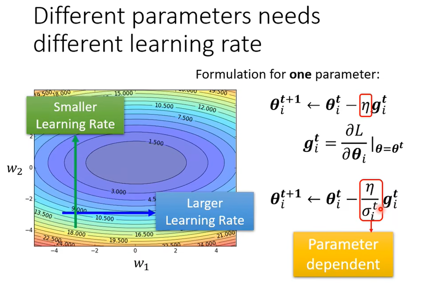
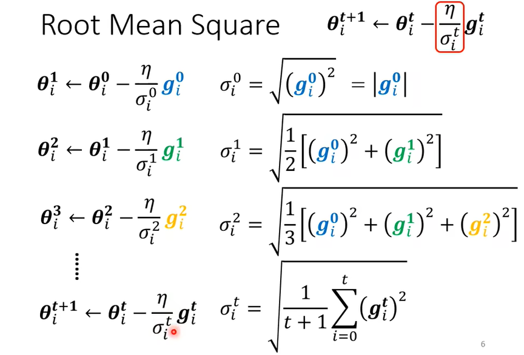
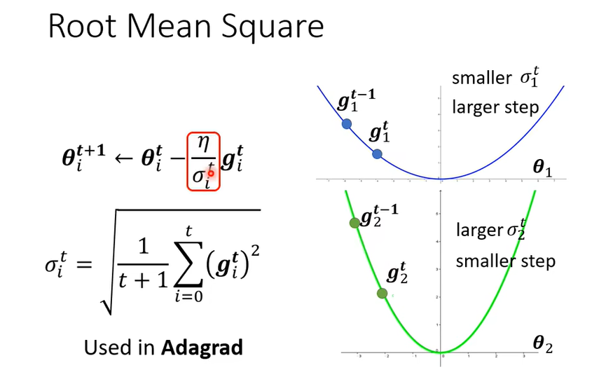
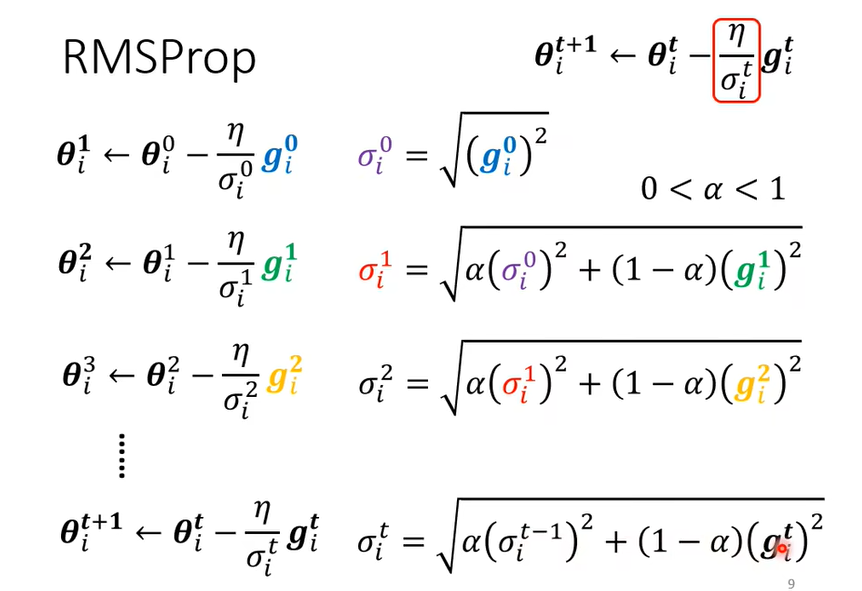
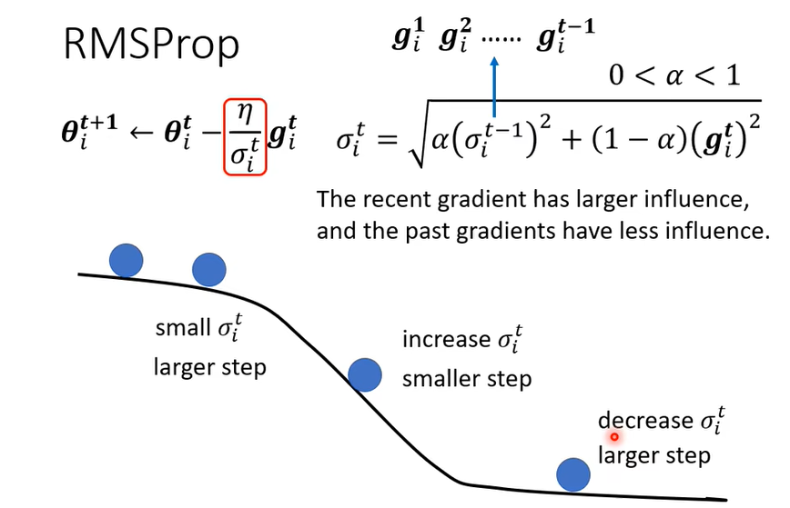
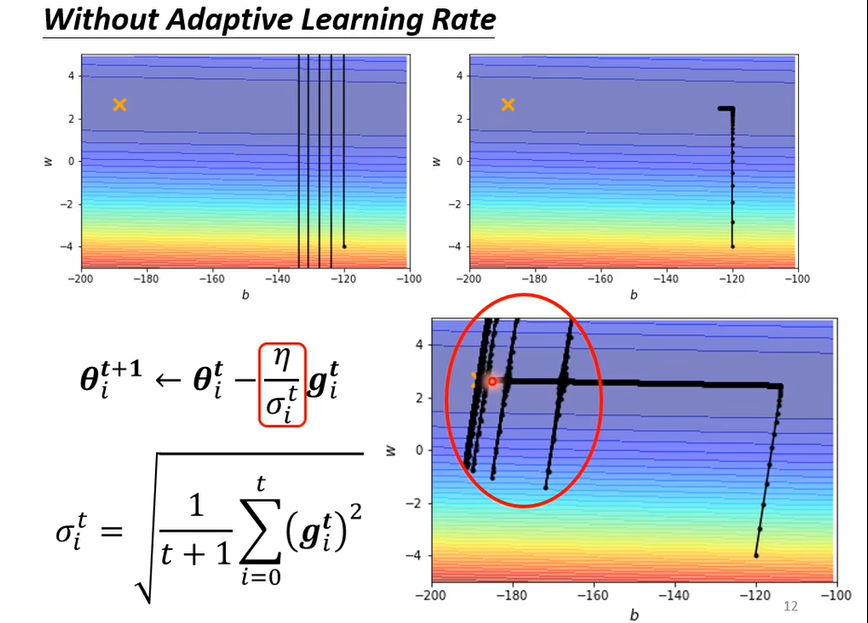
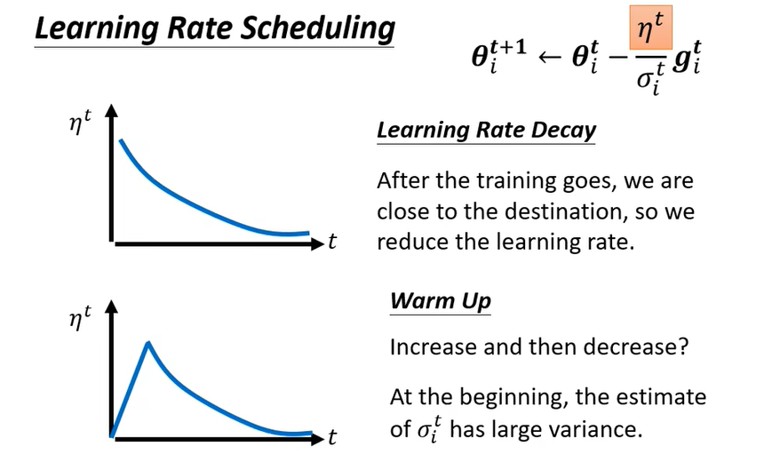
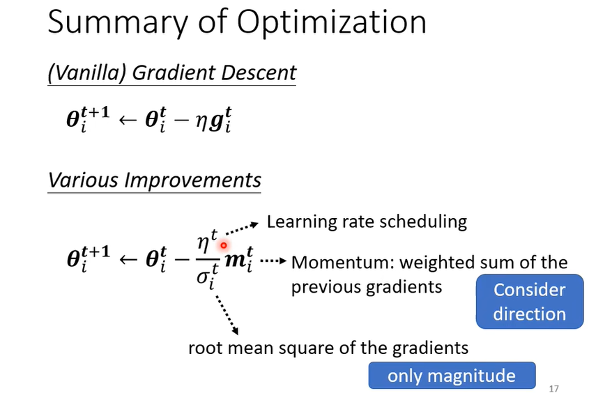

### 自动调整学习速率(Learning Rate)

1、人们认为训练停滞不前是因为参数接近临界点，但往往在梯度没有下降为趋近0的时候，损失值loss就趋近平稳，达不到临界点。

2、学习率不能一刀切：一个固定的学习率往往会导致上述的问题，学习率太大可能会导致不停的在临界点的两边震荡，学习率太小可能会“永远”达不到临界点。

3、不同的参数需要不同的学习率（动态调整）：梯度变化较大的需要更小的学习率，梯度变化较小的需要更大的学习率。

使用了额外参数 $\sigma^t_i$

4、==*root mean square*  均方根==

使用前述所有的梯度的均方根来辅助改变学习率

- 当loss曲线平缓，梯度小，那么学习率变大；

- 当loss曲线陡峭，梯度大，那么学习率变小。

5、RMSProp：在上述方法中认为所有梯度值都有同样的重要性，实际上我们引入 $\alpha$ 来调整每个梯度值的重要程度。

例如，如果我们认为最近的梯度值具有更大的影响力，那么我们设置一个较小的 $\alpha$ ，增大最近梯度值的影响力。

在图中，当突然遇到陡坡时会降低学习率，以免步伐太大；突然遇到平地会增大学习率，以免步伐太小。

6、问题：突然”爆炸“。由于采用前述所有计算的梯度值同等重要方法，对于==y轴方向的参数==来说，一开始梯度值比较大，$\sigma^t_i$ 很大，学习率会慢慢变小。但当 y 轴方向值较小的梯度值个数越来越多时，又会不断影响 $\sigma^t_i$ ，使得 $\sigma^t_i$ 的值变小，累积一定程度后，学习率 $\frac{\eta}{\sigma^t_i}$ 会突然变大，梯度值又会变大，在y轴方向产生震荡，直到出现足够多能够平衡前述梯度值影响的梯度值。之后的情形类似。

解决：学习率调度：1. learning rate decay：学习率衰减，随着训练进行不断减小 $\eta^t$ 值，可以解决上述问题。

2.warm up：先增后减（可能的原因：由于刚开始没有数据，$\sigma^t_i$ 方差很大，所以增大 $\eta^t$ 限制学习率快速变大，先收集一些数据，然后再开始正常训练）。应用在许多模型：例如==Transformer==。

7、总结：优化时使用到：

- mementum动量：计算时使用到前述所有梯度值，但是考虑梯度的方向。
- $\sigma^t_i$：前述所有梯度值的均方根（或带参数 $\alpha$ ），只考虑大小。
- $\eta^t$：学习率调度

综合来进行参数的更新。

