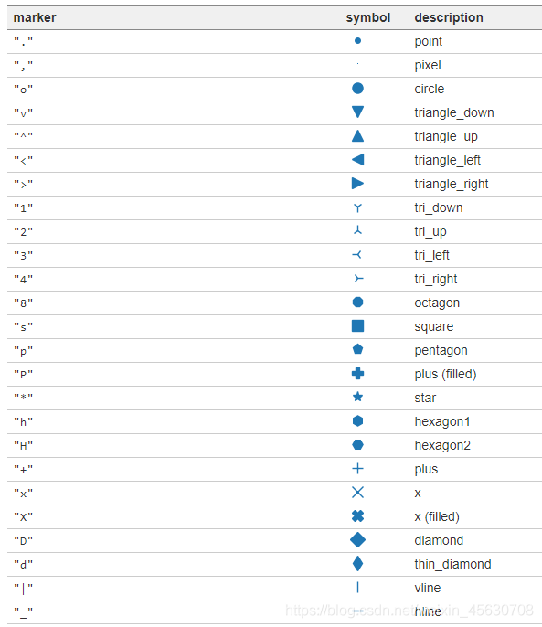

1. 导入

```python
import matplotlib.pyplot as plt
import numpy as np
```

2. `figure` 图像与 `Axes`：

```python
# figure 可以理解为画布，可以通过多个 plt.figure() 设置多个画布
# num 指定 figure 号
# figsize 指定大小
fig = plt.figure([num,figure=[],...])
# 前两个参数将画布分为 n 行 m 列的多个方格，
# 第三个参数在 [1,n*m] 之间，代表在某个方格中生成坐标轴 ax
ax = fig.add_subplot(1,1,1)

# nrows, ncols 将画布分为多个方格
# 为每个方格自动生成一个坐标轴 ax
# figsize 指定画布大小
# sharex,sharey 指定多个方格是否共享 x 轴，y 轴
fig, axes = plt.subplots(nrows=2, ncols=2[,figsize=(8,6)])
axes[0,0].set(title='Upper Left')
axes[0,1].set(title='Upper Right')
axes[1,0].set(title='Lower Left')
axes[1,1].set(title='Lower Right')
```

2. `plot()` 函数画线：

```python
# x,y 为横纵坐标
# linewidth 指定线宽
# linestye: '--'(虚线) / ':'(点虚线) / '-.'(线点需线) / ''(无线，即散点图)
# marker: 'o'(圆点) / 'x'(x形) / 'v'(三角形)，点的标记样式，最下方有 marker 符号大全
# markersize 设置标记大小
# markerfacecolor 设置标记中心颜色
# markeredgecolor 设置标记边缘颜色
# markeredgewidth 设置边缘宽度
# 对于常见颜色，可用 'ro--' 这种格式快速指定颜色，点标样式，线的样式
# alpha 参数表示不透明度
ax.plot(x,y[,color='red',linewidth=1.0,linestyle='--',...])
ax.show()
```

3.  `scatter()` 函数画散点图：

```python
ax.scatter(x,y) # color 参数，marker 参数，alpha 参数同 plot() 函数
# s 参数指定每个点的大小
```

4. `bar()` 画条形图：

```python
# bar() 垂直方向条形图，barh() 水平方向条形图
# height / width 设置条形的 高度/宽度
# bottom 设置柱子底部所在位置，默认为 0
# align 参数设置条形在 x 轴的对齐方式
	# center : x 位于条形的中心位置
    # edge : x 位于条形的左侧，如果想让 x 位于条形右侧，需要同时设置 width 为负数。
# 返回 artists 数组，对应可操作每个条形
vert_bars = ax.bar(x, height, width=0.8, color='lightblue', align='center')
horiz_bars = ax.barh()
# edgecolor 设置边缘颜色
# facecoloe 设置中心颜色
# linewidth 设置边缘宽度
bar.set(edgecolor='darkred', facecolor='salmon', linewidth=3)
```

5. `hist()` 画直方图：

```python
# x 为数据，可为二维数组
# bins 为直方图的区间数
# density 表示 y 轴对应的是 概率(True)/数量(False，默认)
# histtype 表示各列数据的展示方式：
	# bar 对应多列数据以相邻的多个条形方式展示(默认)
    # barstacked 对应多列数据以堆叠的单个条形方式展示
# color 为二维数组的每一列定义颜色
# label 为每个条形定义名称
# rwidth 定义直方图各区间的间隔
ax.hist(x, bins, density=True, histtype='bar', color=colors, label=colors, rwidth=1)
```

6. `pie()` 画饼图：

```python
# size 为数据，表示划分饼图的各百分比
# labels 为每块饼图定义名称
# autopct 表示格式化百分比精确输出
# shadow 表示是否有阴影
# startangle 表示逆时针角度，从那个角度开始分饼图
# explode 指定突出那一块，以及突出的距离大小
# pctdistance 表示 '百分比数字' 距离圆心的距离，默认为 0.6
ax.pie(sizes, labels=labels, autopct='%1.1f%%', shadow=True, startangle=90, explode=(0,0.5,0,0), pctdistance=1.12)
```

7. `boxplot()` 箱形图：

```python
# vert 指定垂直方向
ax.boxplot(x)
ax.boxplot(np.random.randn(3,4), vert=False) 
```

[更多参数](https://www.jb51.net/article/255191.htm)

8. `contourf()` 等高图：

```python
ax.contourf(x, y, z) # z 为距离 x,y 平面的距离，大小为 (y 长度, x 长度)
```

9. 水平/垂直画线：

```python
axes[0].axhline(0, color='gray', linewidth=2) # 水平画线
axes[1].axvline(0, color='gray', linewidth=2) # 垂直画线
```

10. 参数关键字画图：

```python
# 关键字参数绘图
# 利用 data 关键字，将字符串参数从 data 字典中寻找对应参数
data_obj = {'x': x,
            'y1': 2 * x + 1,
            'y2': 3 * x + 1.2,
            'mean': 0.5 * x * np.cos(2*x) + 2.5 * x + 1.1}
# 填充两条线之间的颜色
ax.fill_between('x', 'y1', 'y2', color='yellow', data=data_obj)
ax.plot('x', 'mean', color='black', data=data_obj)
```

11. 设置坐标轴及标题：

```python
ax.set_xlim([xmin, xmax])   # 设置 X 轴的区间
ax.set_ylim([ymin, ymax])   # Y 轴区间
ax.axis([xmin, xmax, ymin, ymax])   # X、Y 轴区间
ax.set_ylim(bottom=-10)     # Y 轴下限
ax.set_xlim(right=25)       # X 轴上限
# 上述 set_ 形式同样适用于下述 set() 函数的参数
# 但形如 set_title/set_xlabel/set_ylabel 方可单独对文字的字体大小，字重等进行设置
	# fontname 设置字体
	# fontsize 字体大小
	# weight='bold' 设置粗体，字重
	# style='italic' 设置斜体
ax.set(ylabel='', xlabel='', title='') # 设置 X、Y 轴名称与图标题
ax.set(xlim=[], ylim=[]) # 设置 X、Y轴区间

plt.title('title') # 设置标题
plt.xlabel('xlabel')
plt.ylabel('ylabel') # 设置坐标轴名称
plt.xlim((-1,2))
plt.ylim((-2,3)) # 设置坐标轴范围

# 设置坐标轴比例变换
ax.set_xscale('linear') # 线性
ax.set_xscale('log'[,base=2]) # 对数
ax.set_xscale('symlog'[,linthresh=0.01]) # 对称对数，由于对数在 0 处无意义，需要特定的界限值
        # linthresh ，使得 data 在区间 (-∞,-linthresh) ∪ (linthresh,+∞) 使用对数映射，
        # 而在区间 [-linthresh, linthresh] 使用线性映射。
ax.set_xscale('logit') # 逻辑回归
ax.set_xscale('function', functions=(forward, inverse)) # 自定义函数
```

12. 设置坐标轴刻度：

```python
ax.set(xticks=[], xticklabels=[]) # 设置坐标轴刻度与刻度名称，
								  # 可用 r'$...$' 表达式修改字体，表达式内可用 latex 表达式
ax.tick_params(axis='y', direction='inout', length=10)
				# axis : x / y / both
    			# length : 刻度长度
        		# width : 刻度宽度
                # direction : in / out / inout ，刻度朝向
                # pad : 刻度名称与刻度间的距离
                # color、labelcolor、colors : 刻度、刻度名称、两者皆有 颜色
                # labelsize : 刻度名称字体大小
                # bottom、top、left、right : 四个边框的刻度是否显示，boolean 值
                # labelbottom、labeltop、labelleft、labelright : 同理
                # which : major / minor / both ，选择主副刻度进行操作
# 也可形如下方单独设置 x/y 轴刻度
ax.xaxis.set_ticks_position('bottom') # 设置刻度朝向

# 设置坐标轴刻度与刻度名称，可用 r'$...$' 表达式修改字体，表达式内可用 latex 表达式
plt.xticks([],labels=[]) # 设置坐标轴上
plt.yticks([-2,-1.5,0,2,3],[r'$\alpha_i$','bad','normal','good','fuc**** good'])
```

13. 设置边界：

```python
ax.spines['top'].set_visible(False) # 设置边界不可见
ax.spines['bottom'].set_position(('outward', 10)) # outward : 移动边界离 Axes 10 个距离
ax.spines['left'].set_position(('data', -1)) # data : 移动边界到 x/y 轴 -1 刻度处
ax.spines['top'].set_position(('axes', 0.75)) # axes : 移动边界至 Axes 的百分比位置
# 上述 set_ 形式同样适用于各种可修改参数，如 linewidth、linestyle、alpha 等等
# 同样也可用 set() 函数同时设置多个参数
ax0.spines['top'].set(position=('axes',0.7),linewidth=20)
```

14. 布局：

```python
fig.tight_layout() # 自动调整布局

fig.subplots_adjust(wspace=0.5, hspace=0.3,
                    left=0.125, right=0.9,
                    top=0.9,    bottom=0.1)
					# wspace、hspace : 子图间的水平与垂直间隔
    				# left、right、top、bottom : 上下左右外边距
        			# 参数取值范围都为 [0,1]
        
ax.margins(x=0.1, y=0.1) # 修改水平和垂直内边距
```

15. 设置图例：

```python
# 首先为每个图设置 label
# loc 可设置图例位置为 best、upper/lower left/right/center、center [left/right]、right
# 
ax.legend('best')
```

16. 图层顺序：

```python
设置各图像的 zorder 参数，zorder 越大，图层越往外
```

17. 保存图像：

```python
plt.savefig('./test.png',dpi=分辨率)
```


##### 各种marker符号：

