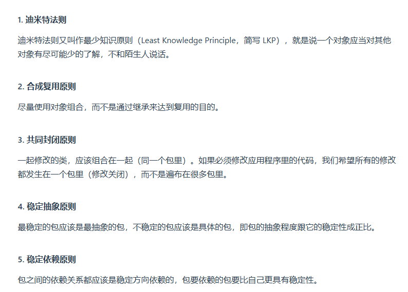

### C++

- STL 栈和队列也不被归类为容器，而被归类为container adapter容器适配器。栈的底层实现可以是vector，**deque**，list。

## 面向对象

### 1、设计原则

1.  **单一责任原则**：修改一个类的原因应该只有一个。
2. **开放封闭原则**：类应该对扩展开放，对修改关闭。
3. **里氏替换原则**：子类对象必须能够替换掉所有父类对象。
4. **接口分离原则**：不应该强迫客户依赖于它们不用的方法。
5. **依赖倒置原则**：
   - 高层模块不应该依赖于低层模块，二者都应该依赖于抽象；
   - 抽象不应该依赖于细节，细节应该依赖于抽象。

